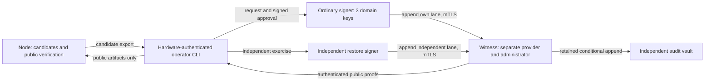

# Stage 2C native signer and independent witness architecture

Status: proposed deployable architecture for review; DESIGN ONLY. Base `cf0b89fbc23ba7d7613f647aa842b1dbaef32cb5`. No implementation, resources, databases, keys, credentials, network calls, deployments or production wiring are created. Proposed protocol names below are not implemented contracts.

## 1. Topology and trust model

Use a hybrid deployment: keep PublicTradeIntel Node in its existing Render environment; place the ordinary native signer on one dedicated Linux VM in a signer-only account; place the witness on another Linux VM at a different provider/account, under separate administration. Connect authorities using a private authenticated overlay and application mTLS. Neither application HTTP listener is public. A separately administered retained audit vault stores witness history with conditional append; it is not the research S3 bucket. Exact vendors and SKUs remain a procurement/compatibility gate; current vendor capabilities/prices were not queried under this task's no-network instruction.

| Trust domain | Authority | Exclusions |
| --- | --- | --- |
| A: PublicTradeIntel Node | Candidate evidence/requests and public verification | No signing/approval/witness private keys, signer journal administration, kms:Sign, signer role or witness append permission |
| B: signing authority | Validate request and operator approval, consume requests, sign exact Ed25519 bytes, persist issuance | No market data, inference, prediction, research-bucket access, witness administration or witness private key |
| C: witness authority | Independently validate journal transitions, serialize checkpoints, sign acknowledgments, retain history | No attestation/operator private keys, issuance initiation or signer database writes |

Domain B needs a further isolation boundary: provider/runtime/ordinary-restore keys live on the ordinary signer; the independent-restore key lives on a separately administered recovery workstation/appliance, used for independent exercises. It has a separate issuer, client identity, store ID and journal. A fourth key in the ordinary signer process is not meaningful independent-restore isolation. This is a fourth physical host counting the recovery workstation, not a fourth online cloud service. Its key must not live on the ordinary signer or witness.

A compromised Node cannot authorize issuance. A compromised signer cannot forge witness/operator signatures or replace witnessed history. An unlocked compromised signer can produce mathematical signatures, but consumers reject those without approved, completed, witnessed issuance. The witness validates authorization as well as monotonicity. Signatures prove authorized provenance/binding, not factual truth of fabricated observations; independent restore supplies a separate factual check.

No shared writable disks, database credentials, deploy tokens, backup deletion credentials, administrator sessions or recovery accounts across signer and witness. If one person can freely replace both services, roots and retained history, independence is not established. Two accountable administrative custodians are a prerequisite for this claim. Collusion or replacement of all pinned trust roots is outside the defended boundary.

## 2. Minimal services and network rules

Use pinned Linux LTS images, one non-root service process per authority, local durable block filesystems and explicit single-writer ownership. Qualify final OS/runtime builds later. No autoscaling, active-active replicas or network-mounted SQLite. Read-only application images expose only their data/key paths. Disable core dumps, heap/debug endpoints and secret-bearing request logs; avoid swap or require encrypted swap. Host administration is separate from runtime identity.

| Connection | Default and authorization |
| --- | --- |
| Node -> signer | Denied initially. Operator-mediated candidate export suffices. Future expressly approved submission identity submits candidates only, never approval or registry changes. |
| Operator -> signer | Private overlay/HTTPS, hardware-authenticated login, short-lived mTLS identity, plus exact signed operator approval. Transport identity alone cannot authorize issuance. |
| Signer -> witness | Separate ordinary/independent mTLS identities, namespace/store/domain allowlists; append own lane only. |
| Operator -> witness | Private read/proof export; governance changes require separate independently approved action. |
| Verifier -> witness | No calls during ordinary verification. Manual/asynchronous refresh imports authenticated public bundles; later direct read-only connectivity needs separate review. |
| Witness -> vault | Restricted endpoint, append/read credential without delete or retention-shortening permission. |
| Authorities -> AWS/market/research storage | Denied; no service responsibility requires these calls. |

Bind application listeners to overlay addresses. Encrypted overlay transport may traverse the public internet; issuance endpoints do not. Do not expose a public signer if the eventual Render plan cannot support the selected private client path: retain operator-carried artifact import instead.

Proposed APIs: signer `POST /v1/issuance`, `GET /v1/issuance/{id}`; witness `POST /v1/checkpoints`, nonce-bound `GET /v1/heads/{namespace}`, immutable `GET /v1/proofs/{receiptHash}`. Private health returns sanitized states/reason codes. No generic sign-bytes/key-export/shell endpoints, arbitrary file paths or caller-selected callback URL fetching. Review starting bounds of 2 MiB request, 256-event batch and 30-second operation deadline against actual contract maxima. Explicitly reject excess; never truncate, hash instead of signing, or impose the rejected 4 KiB restriction.

## 3. Native key custody and domain separation

Recommend encrypted per-domain PKCS#8 files on dedicated persistent storage, unlocked by an operator-injected capability during attended activation. Select and benchmark a vetted encryption/KDF format during implementation; no homemade cryptography. Keep the unlock secret outside the VM and disk backup. Planned operator-assisted restart is preferable at this scale to storing a decryption secret beside its ciphertext.

| Approach | Assessment |
| --- | --- |
| Encrypted persistent key file | Recommended baseline; simple encrypted recovery, but unlocked process/host remains privileged |
| OS-protected keystore / TPM | Optional hardening after VM support, migration and recovery qualification; not assumed available |
| Dedicated HSM/native product | Potential non-exportability; qualify exact plain Ed25519 and large-message support, cost and recovery |
| Operator-injected sealed key/unlock | Combine with encrypted files; avoids unattended local unlock secret, requires attendance after restart |
| External signing appliance/service | Possible upgrade with stronger custody; another privileged dependency requiring exact-byte qualification |

Use separate provider, runtime and restore keys on the ordinary host; a distinct independent-restore key and issuer on the independent host. Distinct operator/witness/transport/governance keys and environment-specific key sets. Sign unchanged `q.signingBytes()` and issuance-context bytes using plain Ed25519; verify large fixtures including 95,793 bytes. No digest-signing/Ed25519ph substitution. KMS RAW is not a universal signer for current contracts.

Proposed key directory 0700, ciphertext files 0600, dedicated service UID, no symlinks/hardlinks or group/world access. Runtime reads ciphertext but cannot replace it. Injection uses an authenticated local descriptor/socket bound to the host/session, never environment variables, command arguments, HTTP bodies, browser pages, shell history, logs, repository files or crash reports. No Node/witness access to signer key paths.

Fail closed on absent key, decrypt failure, wrong type/fingerprint, bad permissions or inactive domain. Validate against independently pinned public registry before readiness. Keep unlocked keys in the smallest practical process; wipe temporary buffers and lock memory where supported. JavaScript/OpenSSL cannot promise erasure of every memory copy; host compromise while unlocked remains a risk. Initial operations are attended windows; stop the signer afterward. Unattended unlocking needs a separate custody review.

## 4. Key backup, loss, recovery and lifecycle

Keep authenticated encrypted recovery packages in two geographically separate offline custody locations, containing encrypted key, public fingerprint, domain, format version and integrity/provenance metadata. Never back up plaintext and never put these packages in research S3 or public verification bundles. Use a vetted 2-of-2 recovery-sharing or two-custodian vault release, not a homemade passphrase split. Recovery requires both custodians; normal already-approved issuance need not require two people for every signature.

Test synthetic recovery first. For real recovery, fence the old host, restore and reconcile journals to independent witness/vault heads before unlocking, and record an approved writer epoch. Never start from a restored old journal merely because its key decrypts. After recovery, rotate to a newly reviewed key and registry revision before ordinary operation. Retain recovered key offline for controlled reconciliation only.

Irrecoverable key loss stops new issuance; retained public keys preserve historical verification subject to lifecycle policy. Planned replacement uses RETIRED/cutoff. Suspected compromise uses REVOKED; the current contract denies historical consumption of revoked keys. Preserve public keys and tombstones; do not reset registry revisions or resurrect keys. Registry/epoch/root changes require separately governed witness publication.

Witness, operator and transport roots rotate independently with pinned transitions. Witness compromise freezes consumption; rebootstrap through an out-of-band two-person ceremony, not a transition authorized only by the compromised key. Break glass means stop, fence, revoke access, preserve evidence and reconcile. It never permits approval/witness bypass or manually setting trusted=true.

## 5. Signer persistence

Retain `KRONOS_DURABLE_ISSUANCE_V1` semantics. Proposed ordinary data path `/var/lib/kronos-signer/`, ciphertext path `/var/lib/kronos-signer-keys/`; independent store uses its own host/volume/store ID. These paths are design values, not created here. Store journal, reservations, receipts, registry pins and approval consumption durably; Node and witness receive no mounts.

Use existing SQLite DELETE journaling, synchronous EXTRA, BEGIN IMMEDIATE, immutable logical events and schema/integrity checks on qualified local durable storage. SQLite is suitable for low-volume serialized issuance. Add serving-process ownership/fencing above its transaction locks: no stale PID file as proof of ownership; replacement host requires old-owner fencing and witness-approved writer epoch. All appends bind that epoch. Restart starts locked and reconciling, not automatically signing.

Reservation COMMIT consumes request ID, request nonce and approval nonce atomically. All request/evidence/signer/result bindings and replay protections remain. Back up with a consistent SQLite backup/barrier plus manifest, not live file copying. Preserve consumed-identifier tombstones across backups and archival.

Known implementation gaps: current journal replays history in memory; public journal snapshot caps entries at 10,000; existing open validates historical approvals against supplied operator roots. A revoked operator must not make forensic recovery impossible. Future implementation must distinguish historical validity-at-reservation from current signing/consumption permission, retaining denial of revoked authority for current trust. Never remove roots/reset a journal to bypass a failure. Alert at 5,000 reservations and block before the current snapshot cap; design archival proof/tombstone continuity before rollover. Do not claim unbounded throughput.

## 6. Witness identity, contracts and storage

Use a separate witness Ed25519 key plus mTLS: mTLS authenticates transport, signed receipts authenticate offline history. A TLS response or unsigned checkpoint is insufficient. Witness keys differ from signer/operator/transport/governance keys. Clients pin witness public root and epoch through independent provisioning, never from the candidate being verified.

The existing `KRONOS_ISSUANCE_CHECKPOINT_V1` remains unchanged. It contains store ID, sequence, chain hash and registry revision/hash, but no authenticated witness identity, environment/domain binding or freshness lease. Wrap it in a new, separately reviewed protocol. `journal.checkpoint()` alone is not witness acceptance.

Proposed logical bodies (design, not implemented schemas):

| Record | Exact logical fields |
| --- | --- |
| `KRONOS_WITNESS_APPEND_V1` | version, witnessId, witnessEpoch, environmentId, streamId, storeId, writerEpoch, domainSetHash, priorReceiptHash, fromSequence, toSequence, previousChainHash, ordered journal events/hashes, existing checkpoint, requestDigest |
| `KRONOS_WITNESS_RECEIPT_V1` | version, witnessId, witnessEpoch, witnessKeyFingerprint, environmentId, streamId, storeId, writerEpoch, witnessSequence, previousReceiptHash, requestDigest, fromSequence, toSequence, checkpoint, eventBatchHash, publicBundleHash or null, acceptedAt, receiptHash; detached signature |
| `KRONOS_WITNESS_VIEW_V1` | version, witnessId, witnessEpoch, environmentId, streamId, challengeNonce, issuedAt, expiresAt, current registry revision/hash, store-head receipt hashes/sequences, vaultCheckpointHash, viewHash; detached signature |
| Governance approval | Separate versioned action, namespace, registry/epoch hash, previous version, approving identities, expiry and nonce; do not reuse ISSUE_ATTESTATION for registry/root administration |

Canonical UTC times, safe positive integers, lowercase SHA-256 hashes, bounded exact shapes, unknown-field rejection and the existing canonicalizer. New witness signatures cover a new domain prefix and full canonical body excluding signature, including its validated body hash. Use native Ed25519; these new signatures do not alter existing attestation or approval signing bytes. No keys, credentials, headers, cookies, environment dumps or raw exception text in records.

One global witness receipt sequence serializes publications; each registered store has a contiguous journal lane. Separate global governance state pins registry and writer epochs. Store registration independently binds environment, stream, allowed domains, signer identity and genesis registry. Ordinary signer cannot append independent lane. Check domain inside every event. `priorReceiptHash` is the previous receipt for that store lane; `previousReceiptHash` in the returned receipt chains the global witness log. Genesis values and registry-lane schema are explicitly frozen in slice A before coding.

Transactionally compare current head; require fromSequence=head+1 and every intervening canonical event. Recompute hashes/predecessors, resulting checkpoint and exact transitions. Validate RESERVED request/approval signatures and scopes, uniqueness, pinned registry publication, both ENVELOPE signatures, receipt binding and completion. Maintain permanent uniqueness indexes for request IDs/request nonces/approval nonces across all stores in one environment/stream namespace. Store registration/domain permissions prevent aliasing a new lane to bypass consumption. Witness checks structure/authorization, not factual observations via AWS calls.

A bare checkpoint without intervening events cannot prove continuity. An identical requestDigest returns its exact saved receipt. Same sequence with another hash is a fork: freeze and alert. Reject gaps; client fetches accepted head and resends exact missing batch, never skips/resets. Lost replies are resolved by exact receipt lookup, never another issuance.

Witness SQLite is on its own persistent block disk: synchronous durable transactions, append-only event/receipt/governance tables, unique sequence/predecessor constraints, derived high-water indexes, one serving writer. Retain all non-secret events required to reconstruct acknowledged signer history, not hashes alone. Signer client can request valid append but cannot delete, rewrite, restore, change roots or lower epochs.

## 7. Witness rollback protection beyond its database

A witness database cannot prove it has not been restored backward. A valid old signature is not proof of currentness. Require a separately administered retained audit vault outside both VM backup/recovery paths, with immutable conditional append and an authenticated authoritative monotonic head. This is storage, not another signing authority. Select a non-research, non-AWS service/endpoint at procurement; ordinary versioning or a mutable latest.json is insufficient. Qualify server-enforced no-overwrite/no-rollback behavior and separate retention administration; if unavailable, use a managed append-only audit service rather than weaken the claim.

Before releasing a receipt: (1) durably store the exact signed receipt and event batch locally as pending; (2) append exact batch/receipt and advance vault head with compare-and-swap from the prior hash/sequence; (3) commit local publication marker; (4) return saved receipt. Only one outstanding pending publication is allowed. Vault entries retain canonical signer events and witness receipt so acknowledged history can be rebuilt. Signer has no vault credential; witness append credential cannot delete content, shorten retention or rewrite existing sequence.

Crash before vault append: retry exact bytes, release nothing. Crash after vault append but before local publication marker: authenticate head/object, reconstruct marker and return original receipt. Conflicting content freezes service. Startup and every fresh-view signing compare local/vault heads; restored older DB replays retained vault history before serving. Never sign a fresh view solely because an old local chain is internally valid. Vault outage blocks appends/new views; cached consumer views expire normally.

Signer persists highest witnessed receipt; operators/verifiers persist highest witness epoch/sequence and registry revision. Operator audit exports provide an additional independent history reference. New consumers require an independently provisioned minimum checkpoint, not trust-on-first-use from a restored server. Simultaneous rollback/compromise of vault, all roots and all external pins cannot be detected from the same old signatures; independent custody is essential.

Retain receipt/event lineage and consumed-identifier tombstones for the lifetime of qualification history. Plan one year online initially and reviewed immutable archival before capacity limits. Preserve public verification keys/lifecycle while any evidence is audited. Proposed backups: 35 daily and 12 monthly consistent encrypted snapshots, plus synchronous retained per-append history. Compaction/deletion needs a separately reviewed archival proof design; never automatically delete replay tombstones.

## 8. Exact issuance sequence

Initial mode is attended, concurrency one per signer store. Current registry lifetime is at most 24 hours: plan governed renewal before expiry. Signer cannot self-approve a registry; automatic registry renewal needs separate bounded governance design. Proposed witness-view lease is five minutes, refreshed every minute by an authorized asynchronous/manual path; >30 seconds clock skew denies readiness. Existing exact request/approval/evidence expiry checks remain in force.

1. Construct exact request from candidate evidence. CLI displays bounded evidence summary, full evidence/request hashes, domain, environment/stream, run, signer/fingerprint, policy/software revision, coverage and expiry. An earlier human intent is not a signed approval of a request that does not yet exist.
2. Hardware-authenticate operator; produce existing `KRONOS_OPERATOR_APPROVAL_V1`, lifetime at most five minutes, bound to that request. Submit request/attestation/approval over mTLS. Node and CLI receive no attestation private key.
3. Signer validates schemas, evidence/request binding, approved service/domain, key/lifecycle, registry and independent operator signature/scope. Reject if too little validity remains; do not queue beyond expiry.
4. Authenticate a nonce-bound latest witness/vault view; compare local journal and reconcile any tail without signing. Atomically reserve ID/request nonce/approval nonce in SQLite. COMMIT consumes them.
5. Publish RESERVED and any exact missing predecessors. Witness validates, commits and vault-publishes, then returns signed pre-sign receipt. Verify exact reservation, registry and current writer epoch. No signature before acknowledgment. Recheck approval/request expiry and current key/lifecycle immediately before signing; an expired reservation stays consumed.
6. Produce the two existing plain Ed25519 signatures, verify locally, commit ENVELOPE. Do not return signatures externally yet. Never auto-repeat signing after an ambiguous crash.
7. Derive/commit existing ISSUED receipt. Publish ENVELOPE and RECEIPT events to witness and verify its exact durable acknowledgment. This is not completed issuance yet.
8. Commit local COMPLETED binding exact envelope/receipt. Publish COMPLETED and publicBundleHash, then verify a final durable witness acknowledgment. Completion itself must be witnessed; a pre-completion acknowledgment is insufficient.
9. Return exact envelope/receipt, public registry/provenance, event proof, final witness receipt and current view. Without final acknowledgment, local exactResult is audit retrieval only, not externally usable qualification.

Define publicBundleHash over the canonical public issuance core (request, attestation, approval/public-root reference, envelope, receipt, completion event and registry references), excluding witness receipt/view/proof wrapper to avoid a circular hash. The witness recomputes this core from validated events. Proof wrappers can change with refreshed views while the issuance core stays exact.

Registry/writer epochs use separate governed transitions. Only acknowledged registry versions authorize new issuance. Do not hold a SQLite write lock across network calls. Network retries are bounded/idempotent by append digest; signing retries are not automatic.

## 9. Crash recovery and failure semantics

| Boundary/failure | Behavior |
| --- | --- |
| Before reservation COMMIT | No consumed issuance; same still-valid approval can be resubmitted; changed request requires new approval |
| RESERVED, pre-sign acknowledgment missing | Consumed, no signing; reconcile exact append/receipt |
| Pre-sign acknowledgment, crash before/during/after signing but before ENVELOPE | RESERVED is ambiguous; never auto-sign again. Burn request/approval; manually reconcile before new request ID and new approval. Lost signature has no completion proof. |
| ENVELOPE committed | Verify exact stored signatures, never re-sign; resume receipt/completion only while lifecycle/freshness permits |
| RECEIPT committed | Reconcile/republish exact witness batch, then complete |
| COMPLETED committed, final acknowledgment missing | Do not release trusted result; reconcile exact completion and obtain saved acknowledgment |
| Final acknowledgment durable, response lost | Retrieve identical completed issuance core/proof; no new reservation/signature |
| Signer unavailable/key locked | No new issuance; cached verification survives only within its lease/expiry |
| Witness unavailable/stale/network partition | No new signatures/final release or new trusted views; expire consumer caches |
| Checkpoint gap/mismatch | Halt lane and reconcile authenticated history; never overwrite high-water mark |
| Fork/same sequence different hash | Freeze, preserve evidence, independent administrator review; no automatic branch selection |
| Signer DB restored backward | Fence old host, replay witness/vault events to head before unlock; never accept lower head |
| Witness DB restored backward | Rebuild from independent vault and compare external pins; remain closed if unavailable |
| Operator approval/request expiry | No fresh signing. Valid committed envelope may be recovered exactly only under existing lifecycle/evidence freshness; no new signature |
| Key absent/decrypt failure/fingerprint mismatch | Readiness false, no fallback key; sanitized alert |
| Registry/key stale or revoked | Reject new signing/current qualification; separate audit retrieval from trust |
| Disk full/fsync/integrity failure | Abort uncommitted mutation, stop, reconcile before serving; no false success |
| Clock reversal/skew | Stop issuance/views; controlled correction never extends approval |

Abandonment/recovery sidecar records need separate schema review; do not silently add event types to V1 or delete a consumed reservation. Process-crash tests do not substitute for qualifying actual filesystem flush, host-loss, fencing and backup behavior.

## 10. Local consumption and cached witnessed state

Ordinary verification has no network calls. A separately authorized refresh/manual import obtains public bundles and nonce-bound latest views. Atomically persist highest witness epoch/global sequence, registry revision/hash and minimum accepted heads with the cache. Never roll pins backward. Expired/missing cache means unqualified, not an implicit request from prediction code.

Public bundle includes current approved registry and historical lineage/provenance; original signed approval/public operator roots; request/attestation/envelope/receipt; completed event proof; final witness receipt; witness public roots/transitions; and a fresh view. For low volume provide complete bounded contiguous event segments since a trusted checkpoint, not an isolated event with an unproven hash. Show completion receipt ancestry to the current view, which can be later than completion. New consumers need bootstrap pins and retained proof history. Merkle optimization is unnecessary initially.

Verify bounded shapes/hashes; pinned witness signature/epoch and view lease; monotonic minimum heads and predecessor chain; governed current registry and historical lineage; completed issuance and exact approval/request binding; both envelope signatures and receipt; current/historically permitted signer state (RETIRED cutoff, REVOKED denial); environment/stream/policy/software; evidence age, full coverage and distinct independent issuer/key. Rebuild V3 on every consumption, never accept a source-provided trusted boolean.

Revocation visibility is bounded by the proposed five-minute lease, not instantaneous: offline verification cannot discover new revocation without fresh authenticated information. Earliest registry/view/evidence expiry wins. Emergency authenticated invalidation may shorten that window. Audit verification after key loss differs from current qualification eligibility.

Current `consumeQualification()` accepts a private local journal handle and one exact checkpoint. It cannot verify remote public proofs or combine ordinary and independent journals. Add a separately reviewed public-proof verifier and multi-store assembler; preserve existing signatures/lifecycle and false readiness outputs. Do not give Node a signer DB copy, fabricate a journal handle or concatenate unrelated chains. Current global registry must recognize both stores; each request's historical registry is an approved ancestor.

## 11. Operator CLI and governance

Recommend a dedicated operator workstation with FIDO2/WebAuthn user verification for private administrative login and a hardware-backed Ed25519 approval key requiring touch/PIN. Hardware login alone does not produce a compatible approval signature: qualify a device/driver capable of signing exact existing approval bytes with plain Ed25519. Generic FIDO2 devices may expose only WebAuthn assertions. If compatible hardware is not selected, separately review an isolated approval agent protected by hardware login; do not silently change algorithms or move approval keys to Node.

CLI fetches/exports bounded evidence, validates locally, displays human-readable scope/coverage/expiry and complete hashes, rejects terminal-control characters, obtains explicit approval, signs exact artifact, submits once and retains public outcome/proof. No signer key, generic sign command, approve-all, shell interpolation, or secret output. Independent restore uses its own scope/issuer. Pending approvals are not reusable browser bearer credentials.

Pinned operator roots are currently configuration, not a complete operator directory. Govern root changes, retain validity history and distinguish historical audit from current revocation. Registry/root/epoch/retention changes need distinct two-person governance approvals, not ISSUE_ATTESTATION. Ordinary issuance can require one named authorized operator. The custody and hardware adapters are future implementation, not present services.

## 12. Future secrets and permissions

| Secret | Owner/storage | Rotation/recovery | Exposure boundary |
| --- | --- | --- | --- |
| Three ordinary attestation keys | Signer custodian, encrypted disk and temporary unlocked process | Per-domain rotation, two-person encrypted recovery | Ordinary signer only |
| Independent restore key | Independent custodian, recovery host/hardware or encrypted file | Separate ceremony/backup | Never ordinary signer/witness/Node |
| Unlock/recovery capability | Two custodians, independent hardware-protected custody/offline shares | Rotate after exposure or recovery | Restricted local unlock channel; not environment |
| Witness acknowledgment key | Witness administrator, independent encrypted keystore | Pinned root/epoch transition; compromise freezes trust | Witness only, cannot sign attestations |
| Operator approval key | Named operator, qualified hardware | Revoke/re-enroll public root under governance | Hardware operation only |
| Governance keys | Separate custodians, hardware/offline custody | Two-person pinned transitions | Not app/signer root-edit authority |
| mTLS/overlay identities | Per service/operator restricted credential store | Target 24-hour certificates; immediate revocation; reviewed bootstrap | Route identity does not replace signed approval |
| Vault append/read credential | Witness workload, independent scope | Rotate on exposure, no delete/retention-admin rights | Not signer or Node |
| Backup recovery keys | Independent backup custodians | Versioned encrypted backups and drills | Never plaintext beside backup |
| Provider/admin credentials | Separate administrators with hardware MFA | Workforce revocation and audited emergency access | Never runtime processes |

Node may eventually hold a read-only transport identity and public pins only. Signer appends only its registered lane. Witness manages its own chain/vault append scope, not attestation issuance or signer files. Neither runtime grants itself governance permission. All future schemas/logs use allowlists rejecting credentials, Authorization headers, PINs, cookies, private keys and environment dumps.

## 13. Backup, RTO/RPO, monitoring and audit

These are design targets, not measured production guarantees. Qualify them before live use.

| Asset | Backup/recovery design | Target |
| --- | --- | --- |
| Signer reservations/journal/receipts | Consistent encrypted daily snapshot; every pre-sign reservation and released result retained by witness/vault; replay to authenticated head | RPO 0 for witness-acknowledged reservations and released results; RTO 4 staffed hours |
| Unwitnessed local tail | May be lost with disk; no signing/release before required acknowledgment; reconcile before serving | No zero-loss claim for unacknowledged acceptance |
| Public registry/operator pins | Versioned governance artifacts in authorities, vault and operator exports | RPO 0 for activated versions; current authenticated lineage required |
| Witness chain | Synchronous retained vault append before response plus independent encrypted daily snapshot | RPO 0 for released receipts subject to qualified vault durability; RTO 4 staffed hours |
| Public keys/lifecycle | Replicated public archive, signed manifests and custodian copy | Preserve audit verification while evidence is retained |
| Private recovery material | Authenticated encrypted offline copies with separate two-person unlock custody | Target recovery within one business day; public history survives key loss |

If vault durability loses acknowledged records, these RPO claims fail and services freeze; never hide loss with new genesis. Daily snapshots alone imply up to 24-hour loss. Acknowledged public event history must reconstruct exact signer events and consumption tombstones. Restore authorities separately, compare external heads, fence old owners, test wrong/older snapshots and never restore both from a common administrative snapshot.

Monitor private liveness each minute and readiness states LOCKED, RECONCILING, READY, DEGRADED, FROZEN. Proposed alerts: unexpected outage >2 minutes during scheduled operation; witness lag >60 seconds; rollback/fork/mismatch, signature/fingerprint or vault acknowledgment failure immediately; >3 operator replays in 5 minutes; registry expiry warning at 2 hours, planned key expiry at 7 days and short-lived certificate expiry at 2 hours; disk <20% warning, <10% stop reservations; daily backup older than 26 hours; expired restore drill. Planned signer lock outside attended windows is not an incident. Witness remains online for view refresh; restart may require its separately authorized unlock. No prediction alerts.

Monthly synthetic authority restore/replay/fork drill and quarterly independent host-loss/key-recovery exercise; overdue drill blocks operational trust renewal. Real-key recovery experiments need explicit approval. Track replay latency, memory/disk growth, pending vault publications and proof-cache age. Rate limits and caps must not silently alter valid signing input semantics.

Operator-readable audit identifies who approved, approval/request/evidence hashes, domain/namespace, signer/fingerprint, registry revision/hash, writer epoch, witness sequence/receipt/hash, result/reason and UTC time. Distinguish RESERVED, SIGNED_LOCAL, WITNESSED, COMPLETED_LOCAL and RELEASED; signing alone is not issuance success. Audit governance, backup and recovery separately. No secrets or raw provider exceptions. Public cryptographic material can still contain sensitive operational evidence: restrict readers.

## 14. Sizing, placement and cost class

Planning load: attended batches, tens to hundreds of requests/day initially, one issuance in flight per store; measure actual demand before revising. Ordinary signer: 1 vCPU, 1 GiB RAM, 10 GiB durable disk. Witness: 1 vCPU, 1 GiB RAM, 20 GiB durable disk. Independent signer: dedicated recovery workstation with at least 1 GiB free RAM and 10 GiB encrypted durable space. One serving process/writer per SQLite store. Benchmark 100 KiB-plus messages, bounded 2 MiB requests, cold-start replay and consistent backups. Increase RAM before changing message semantics to optimize memory. Qualify filesystem flush and writer fencing on chosen hosts.

| Placement | Tradeoff | Recommendation |
| --- | --- | --- |
| Same Render workspace | Easy operations but common administration/deployment blast radius | Reject for independent-authority claim |
| Separate Render workspaces | Better permissions, potentially common organization/provider recovery; actual connectivity/storage unverified | Possible only after independent custody is demonstrated |
| Separate accounts, same provider | Better IAM, shared provider failure mode | Fallback with independently retained vault and explicit risk acceptance |
| Separate accounts/providers; Node stays Render | Clearer admin/storage separation, extra overlay/patching work | Preferred |

Two small allocated VMs, retained audit storage, encrypted backups and operator hardware/workstation are sufficient; no cluster, message broker or commercial HSM is required initially. Cost class is low infrastructure spend with moderate operational/security effort. Budget allowance only, not current vendor pricing: approximately US$50-150/month hosting/storage/backup, excluding labor, workstation and hardware; obtain quotes during separately authorized procurement. Estimate 2-4 hours/month routine patch/backup/drill work plus attended issuance/recovery, then measure in pilot. A commercial HSM/appliance increases cost and compatibility work.

Availability deliberately favors trust over uninterrupted issuance: signer restart awaits unlock, failures stop issuance, no automatic failover. Witness outage expires qualification-view leases. Legacy prediction operation is unchanged; availability pressure does not permit bypass. No current platform SLA/features/prices were verified in this no-network task.

## 15. Controlled future slices and exit criteria

| Slice | Scope | Exit criteria |
| --- | --- | --- |
| A: witness offline | Append/receipt/view/governance schemas, persistent witness, fake retained vault, pure imports | Forgery, wrong namespace/domain, gaps/forks, writer epochs, duplicate append, signer/witness/vault rollback, every local/vault crash boundary, clock/lease and secret tests; synthetic keys only |
| B: signer offline | Native adapter, locked-key lifecycle, ownership, dual approval, bounded endpoints | Exact signature compatibility including 95,793-byte fixtures and contract maxima; wrong/absent key, approval replay, all six crash boundaries, ambiguous signing denial and expiry/revocation tests |
| C: offline authority integration | Witness-before-sign, witnessed completion, registry lanes/epochs, multi-store history, backup replay | Partitions/lost replies, cross-store nonce replay, independent-role separation, recovery/RTO/RPO simulations; no usable unwitnessed result |
| D: operator CLI offline | Bounded review, hardware abstraction, approval/governance and public export | Wrong request/role/environment denied, expiry/replay, sanitized output, Node exclusion; exact hardware compatibility plan |
| E: separately approved provisioning | Vendors/SKUs, hardened hosts, ACL/overlay, custody, vault and roots | Independent admins, private endpoints, no shared credentials/disks, authorized key ceremony, encrypted recovery; no real evidence issuance |
| F: synthetic live qualification | Separately authorized synthetic issuance and controlled operational-key tests | Byte compatibility, durable witness/vault, host/process restore, rollback/fork, lost reply, revocation/expiry, independent restore and audit qualified |
| G: real evidence issuance | Separate authorization per provider/runtime/restore/independent evidence set | Fresh observed evidence, exact approvals, completed witness proofs; no fabricated production claims or automatic collection |
| H: V3 public consumption | Public-proof verifier/multi-store assembler, then separately approved Node integration | Expired/revoked/partial/full/rollback cases, zero network in ordinary verification, no Node private capability, protected Legacy fingerprint and all regressions |

Next task: slice A, witness offline implementation, including its exact protocol and simulated vault durability. Treat tests for dishonest/stale witness views and cross-store replay as first-class exit criteria. Each future code slice runs focused plus signer/preflight, qualification, S3/retention, prior-slice, production/import/Legacy and discovery regressions. Dependency audit requires separately authorized network access. Preserve signing bytes and false readiness flags. Separate approval is required for commit/merge and provisioning.

## 16. Exact future provisioning order (not executed)

1. Approve design, independent custodians, exact providers/vault semantics, budget and recovery policy; complete offline slices A-D and public-proof design. Qualify hardware plain-Ed25519 support before device selection.
2. Establish independent witness/vault accounts and administrative roots; review retention/CAS and recovery capabilities. No signer credentials in these accounts.
3. Provision witness storage/service/vault only under separate authorization; perform witness-key custody ceremony, pin public root/epoch/genesis out of band.
4. Qualify witness-only synthetic append, vault publication, crash/rollback and backup restore before admitting a signer.
5. Provision signer VM/disk and independent recovery host, isolated UIDs, mTLS/overlay and backup custody; verify fencing and no Node access.
6. Enroll hardware operator/public roots and separate governance custodians; qualify unlock/approval channels without real evidence issuance.
7. Generate domain/independent keys only under explicit key-ceremony authorization; encrypted offline backups, fingerprint comparison, no Node/research-storage private material.
8. Publish governed registry, registrations, domain ACLs, epochs and pins to witness/vault. Install public trust material only in consumers.
9. Synthetic end-to-end issuance, exact signatures, replay/restart/partition, both DB rollbacks, vault-fork denial and independent restore; measure RTO/RPO and cache expiry.
10. Two-person recovery/rotation drill; fence old host, preserve history, prove no pin rollback; independent review before real evidence.
11. Separately authorize fresh provider evidence/issuance, then runtime, full ordinary restore, then separately executed independent full restore. Do not reuse expired past observations.
12. Separately review public V3 proof import/production integration, migration and production restore drill. Keep automatic collection disabled pending all remaining gates.

## 17. Readiness and task validation

Before real provisioning: accepted design and independent administrators; implemented/validated witness, signer, integration, operator CLI; qualified key format/hardware/vault; reviewed exact identities/firewalls/backups; sizing/cost approval; separate provisioning/key-generation authorization. This document is not deployment-ready software.

Before real attestation issuance: qualified custody/services/vault; current witnessed registry/operator roots; synthetic crash/replay/rollback/recovery passes; usable public proof verification; fresh authorized evidence and explicit real-issuance approval. Signature success alone is insufficient.

Before automatic shadow collection: storage qualification complete, full required restore coverage including forecasts/corrections/outcomes, independent restore, reviewed production migration, successful production restore drill, qualified live V3 receipt/witness/lifecycle checks and explicit automatic-collection authorization. Signer/witness deployment alone changes none of these. Automatic collection readiness and production OFF_DISK_VERIFIED remain false.

Only this Markdown design is added. No executable code/contracts/tests are changed, so conditional full code regression is not triggered. Validate scope/whitespace, unchanged runtime/package/lock files and protected prediction-engine boundary. Do not run database-creating suites or network audit in this task. Local origin/main is the previously fetched tracking ref; no remote fetch under the no-network instruction.

Protected buildPrediction fingerprint: `72714872ed27c9c7d1ceac407a87e67d753afb9f6c7cec8f0051cc80631fb1bc`.

Safety: no AWS/Render API calls, keys, databases, resources, IAM/environment changes, deployment, real attestations, migration, inference, forecast calls, scans or production changes. No commit/push. Operational signer remains unprovisioned and independent witness remains unimplemented. Stop after design review.
