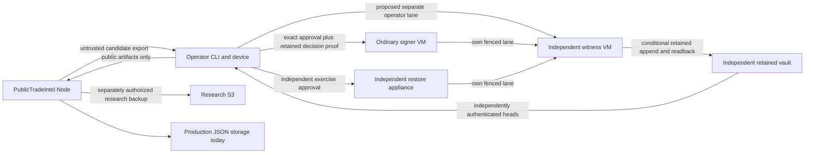

# Stage 2C provisioning-readiness review

Review date: 2026-09-20. Documentation only; no provisioning authorization.
Reviewed source: `c97a9fefe488cb3c3cf6babba4b23363574df895`.
Review branch: `codex/kronos-provisioning-readiness-review`.

**Decision: GO for further offline design/implementation planning; NO-GO for
provisioning, real attestation issuance, automatic shadow collection, or production
influence.** The offline components are coherent within their tested trust model.
They are not deployable operational authority services yet.

**Mandatory provisioning gate: the operator ledger has no independently retained
operational rollback protection. Local append-only SQLite behavior does not satisfy
independent retention. A restored old operator database can lose unpublished denials
and consumed attempts. Do not provision around this limitation.**

All future mechanisms, limits, budgets and runbook steps below are proposals, not
implemented controls or permission to execute them. Historical AWS evidence is
separated from current source tests and has not been refreshed. No live network
was used for this review; the preceding authorized Git push/fetch/merge is the only
remote activity in this task. No vendor feature, price, vulnerability feed, OS
support status, certificate or production environment was checked live.

## 1. Commit and evidence basis

Slice D: `Add offline Kronos operator CLI`, commit
`c97a9fefe488cb3c3cf6babba4b23363574df895`, branch
`codex/kronos-operator-cli-offline`, exactly 25 files, +946/-12.
Normal branch push succeeded. `origin/main` was fetched and matched the approved
base `8ddaa386060702c1e47380c1ef257b6154cbd32e`; main was fast-forwarded and pushed
normally. Local main and origin/main matched the new SHA, with a clean worktree,
before this documentation branch was created. No merge commit or history rewrite.

Pre-commit rerun: 7/7 CLI suites within 64/64 complete offline suites; all prior
integration/native/witness/preflight/qualification/S3/research/import/Legacy
boundaries passed. Discovery: 24/24 plus provenance. Prediction semantics and
autonomous compatibility passed. Offline cached npm audit reported zero
vulnerabilities; this is not a fresh advisory assessment. Diff/new-file whitespace,
JavaScript syntax, package JSON and unchanged dependency/engine checks passed.

Protected buildPrediction SHA-256:
`72714872ed27c9c7d1ceac407a87e67d753afb9f6c7cec8f0051cc80631fb1bc`.

Evidence labels used throughout:

- **SOURCE**: inspected committed implementation; not an operational deployment.
- **OFFLINE TEST**: fictional keys, local processes/stores or mocked providers.
- **HISTORICAL REAL**: earlier user-supplied qualification reports; not re-observed.
- **PROPOSED**: requires review, implementation/qualification and separate authorization.

Primary sources: [research contracts](../../kronos/research-contracts.js),
[storage schema](../../kronos/research-db-schema.js),
[store validation](../../kronos/research-store.js),
[qualification contracts](../../kronos/research-qualification-contracts.js),
[native signer](../../kronos/research-qualification-native-signer.js),
[witness](../../kronos/research-qualification-witness-store.js),
[public proof](../../kronos/research-qualification-public-proof.js),
[operator control](../../kronos/research-qualification-operator-control.js),
[operator ledger](../../kronos/research-qualification-operator-store.js), and the
[prior architecture](stage-2c-native-signer-witness-architecture.md).
Historical design documents describe their own earlier stage; their statements
that later slices are unimplemented are superseded by inspected source, not by
assuming every proposed operational feature was implemented.

Slice D safety reconfirmation: the command surface is exactly pending, inspect <id>,
approve <id> <reviewHash>, deny <id> <reviewHash> <reason>, result <id>, and status.
There is no arbitrary signing, key generation/export, registry mutation, witness
history mutation or approval bypass command. Opaque operator sessions and a distinct
operator key bind exact KRONOS_OPERATOR_APPROVAL_V1 bytes. Explicit confirmation,
TOCTOU/replay/expiry checks, approve/deny race arbitration, crash recovery, local
append-only audit, secret-safe output and self-certification rejection passed the
focused suites. These are offline guarantees, subject to the retention blocker.

Operator/proof artifacts bind applicable model/software/contract/policy revisions,
environment, stream, coverage, evidence timestamp and input cutoff; inapplicable
fields stay explicitly null. Reviewed metadata cannot be changed after inspection
to add look-ahead information. Original KRONOS_OFFLINE_PUBLIC_PROOF_V1 remains
unchanged; the separately signed operator-decision companion independently verifies
approval and denial after source database deletion, without private operator material.

## 2. Complete implementation inventory

Exact identifiers and source locations are catalogued in Appendix A. The following
map distinguishes implemented capability from its operational boundary.

| System | Implemented evidence | Current boundary |
| --- | --- | --- |
| Research protocol/contracts | Collection session, frozen cohort, job, outcome and membership V1 validators | No scheduler or automatic execution |
| Guards/flags | Literal productionInfluence=false; automatic execution throws; disabled-flag stored reads | Flag changes cannot supply missing automatic execution |
| Research SQLite | Schema 1, strict immutable records/blobs, linked transactions/audit/outbox, corrections/dispositions, revisions | Explicit local open only; no production migration |
| Portable recovery | Exact committed-transaction bundles with embedded content; staged restore/replay and local restore receipt | Portable reconstruction does not itself prove off-disk custody |
| Archives | JSONL V1, GZIP_V1, chained manifests, logical/artifact hashes | No operational archival/retention schedule |
| Snapshots | Consistent SQLite backup/barrier; V1 logical manifest and V2 chunk transport/manifest | Tested fake remote restore, not a live production database restore |
| S3 adapter | Lazy real SDK transport, conditional create, exact VersionId, owner/retention/encryption/readback checks | Real transport exists; runtime qualification remains false |
| Retention | Requirement V2, explicit GOVERNANCE/COMPLIANCE and policy hash | Validator requires FIXTURE_ONLY and productionApproved=false |
| Backup journal | Delivery journal V1, durable retry/ambiguity state, immutable artifact identity | Local writer/recovery model; no cross-host deployment |
| Backup checkpoints/discovery | Remote V1/V2 chains, expected-tail witness and recovery bootstrap, bounded listing | Needs independently held current tail/bootstrap in operations |
| Provider qualification | V2 simulated path; V3 authenticated domain observations and coverage assembly | V2 never promoted by relabeling; V3 not wired into production |
| Runtime qualification | Signed runtime/SQLite/storage observations | Real runtime qualification remains unestablished |
| Restore qualification | Exact inputs, counts/hashes, six coverage classes, ordinary and independent roles | Historical real restore covers only three classes |
| Signer registry | Registry V1, pinned hash/revision, role scopes, lifecycle/tombstones | Registry hash is not a self-authenticating trust root |
| Signing requests | Exact V1 request, nonce/evidence/context binding, maximum five-minute window | Trusted composition supplies registry and service identities |
| Signed attestations | Observation signature plus issuance-context signature, Ed25519 | Signing authenticates an observer, not objective truth |
| Issuance receipts | V1 receipt binds request, nonce, signer, envelope and evidence | Hash receipt alone is not independent retention |
| Durable issuance journal | Durable V1 reservation/envelope/receipt/completion, atomic consumed identifiers | Local SQLite; witness-required release adds offline continuity |
| Operator approval | Approval V1 with separately pinned operator signature and opaque grants | Actual hardware signing/authentication absent |
| Witness authority | V1 append/checkpoint/receipt/ACK/view; replay, scope, fork and freshness checks | Explicit local process; no real service/mTLS deployment |
| Retained vault | Separate-process fake vault, conditional sequence and exact readback | Only a fixture; no operational vault authority |
| Native signer | Exact plain Ed25519, pre-sign witness ACK, durable attempt, completion ACK before release | Only fixture key provider; simulated result |
| Cross-process integration | Separate signer/witness/vault/verifier PIDs; signed IPC identity/epoch/challenge | IPC fixture transport, not cross-host TLS or network fencing |
| Public proof | Offline V1 verifies independently of source DBs/private keys/network | External pins/challenge required; operational freshness distribution absent |
| Operator CLI | pending, inspect, approve, deny, result, status; signed decision companion | Fixture executable/presence prompt; local-only decision retention |

Protocol V1 remains: cohort 20; strata 4/4/3/5/2/2; 7-Day mapped to five future
trading bars; eight paths; target/minimum input observations 512/252; concurrency
one; 20-minute session limit; sector cap 25%. These are input/study protocol
parameters, not evidence of statistical power or a completed prospective study.
Manual observations remain excluded from primary prospective membership.

## 3. Trust topology and minimum architecture

Retain the prior minimum: one ordinary signer VM with three distinct role keys;
a witness VM under a separate provider/account and administrator; an independent
restore workstation/appliance with its own signer; a retained vault outside both
signer and witness recovery paths; and a hardware-authenticated operator interface.
Node stays in its existing environment. Do not add a cluster/broker solely for
this low-volume workload. A dedicated vault VM is not mandatory if a qualified
managed service supplies the required independent semantics.

The new operator lane and independent head path are proposed. No shared writable
disks, administrative recovery accounts, deploy tokens, unlock credentials or
backup deletion authority across independent domains. Administrative collusion or
replacement of every external trust root is outside the claimed protection.

| Domain | Trusts | Must not trust | Keys/credentials |
| --- | --- | --- | --- |
| Node | Independently installed public roots, verified public artifacts and current policy | Candidate-provided roots, self-certified qualification, signature without completion | Existing application/market-data credentials; future narrowly scoped research S3 identity; no authority private keys |
| Human operator | Reviewed policy, verified summary, independent public pins and time | Node-rendered claims without evidence review; workstation presence as hardware proof | Personal hardware authentication/approval authority; no application PIN authority |
| Operator CLI/device | Pinned operator identity, authentic device response, current retained decision head | LOGIN_PIN/ADMIN_PIN, caller-created session objects, restored ledger as current truth | Separate approval key; short-lived transport credential; device unlock outside application |
| Ordinary signer | Exact approval/decision, pinned registry, current writer permit and witness ACKs | Node authorization, own old DB as latest head, bare TLS as approval | Distinct provider/runtime/restore private keys, own mTLS identity; no research S3/vault-admin credential |
| Independent signer | Same protocol with separate issuer/lane and independently observed restore | Ordinary host's claimed independence, copied measurement result | Separate independent-restore key and transport identity |
| Witness | Governed roots/epochs, authenticated lane, valid events, independent vault head | Signer sequence claims, unsigned/unpinned vault head, own snapshot alone | Witness signing key, own mTLS key, append/read vault credential only |
| Retained vault | Approved namespace/admin policy and authenticated conditional writer | Witness's requested rollback/reset, signer/Node administration | Separate account/admin MFA, provider/service credentials; possible independent receipt root if selected |
| Research S3 | Its scoped access/retention policy; consumers still hash exact versions | ETag as checksum, bucket configuration as proof of full recovery | Separate backup writer/read roles; no signing keys or unlock material |
| Production storage | Existing application persistence contract and controlled migration process | Research proof as permission to overwrite production; restored unverified files | Existing production storage/service identity; no shared signer/witness mounts |

| Domain | Writable state | Allowed future network | Administrative authority | Failure impact |
| --- | --- | --- | --- | --- |
| Node | Existing JSON; future isolated research DB/outbox after migration | Market data, approved S3; initially no direct signer write path | Application administrator only | Bad candidate evidence/denial of service; no forged authority under external pins |
| Operator | Decision/audit ledger and separately held public checkpoints | Private signer/witness access and independent vault-head read | Cannot unilaterally rewrite trust roots or release recovery secrets | Approval compromise or inability to approve; halt affected authority |
| Ordinary signer | Own journal/control store and encrypted key package | Witness/private operator ingress; patch/time endpoints allowlisted | Signer custodian; no witness/vault administrator | Mathematical signatures possible while unlocked; current witness/policy still required for trusted release |
| Independent signer | Independent journal/restore evidence | Own witness lane; restore data through separately scoped process | Separate recovery custodian | Loss of independent evidence; cannot substitute ordinary signer |
| Witness | Own journal/checkpoints | Vault and authenticated authorities; limited time/patching | Witness custodian separate from signer | Forged witness statements possible; external retained heads must detect rollback; stop consumption |
| Vault | Immutable entries, monotonic head/epochs, retained audit | Restricted writers/readers | Separate retention/recovery custodian; runtime cannot delete/shorten | Compromised sole vault can destroy independent continuity; freeze, recover from independent retained replicas |
| Research S3 | New immutable versions and bounded manifests | Approved SDK endpoint only | Research storage admin separated from backup writer | Data disclosure, cost abuse, or missing tail; exact hashes/tail pins reject false recovery |
| Production storage | Existing application files | Existing service-only path | Production owner | Production outage/data loss; authority outages must not alter Legacy behavior |

## 4. Durability classification: what is actually established

Labels are evidence categories, not an automatic promotion ladder. OFF_DISK means
verified separate storage for the named scope; INDEPENDENTLY_WITNESSED requires
independent retained history, not a colocated second process. No component is
PRODUCTION_READY in Stage 2C merely because its offline tests pass.

| Asset | LOCAL_ONLY | PORTABLE_RECOVERY | OFF_DISK | INDEPENDENTLY_WITNESSED | PRODUCTION_READY |
| --- | --- | --- | --- | --- | --- |
| Signer journal/control | Proven local crash/restart tests | Exact public issuance history export/replay in fixtures; operational full-store restore unqualified | No operational proof | Offline witness/vault model only | NO |
| Witness journal | Proven local tests | Fixture reconciliation against retained model | No real vault deployment | Offline model only; own signature is insufficient | NO |
| Operator ledger | Proven API append-only/race/crash behavior | Public decisions portable; entire operational ledger restore unqualified | NO | NO; explicit blocker | NO |
| Registry/public pins | Pinned local configuration and journal events | Public registry in proofs | No established operational governed distribution | Offline registry publication only | NO |
| Witness vault | Separate local fixture store/process | Fixture retained-history reconstruction | NO operational provider qualification | Fake retained model only | NO |
| Research SQLite | Strong local immutable/FK/hash/transaction tests | Bundles, archives and snapshot-tail replay proven offline | Only historical synthetic transaction/audit/outbox artifact | Backup expected-tail contract; no operational independent tail service | NO |
| Research S3 | Not local storage | Exact historical synthetic bundle reconstructed | HISTORICAL REAL, limited synthetic scope | Object retention is not an independent authority witness | NO |
| Qualification records | Serialized records inspectable; trusted handles process-local | Re-verify signed evidence under pinned authority; public proof portable | No established retained operational issuance set | Offline completed proof model | NO |
| Public proofs | Exported public artifacts, no secret requirement | Standalone verification after source DB deletion proven | No operational archive/retention policy established | Verify offline history relative to independently supplied pins; fake-vault limit remains | NO |

The research store enforces DELETE journaling, synchronous=EXTRA, fixed busy timeout,
foreign keys, exact schema/hash checks and immutable evidence. Those checks do not
prove a cloud disk's flush guarantees or survival of account deletion. Qualify the
chosen filesystem/device/backup path and power-loss semantics later.

Operator/preflight/witness SQL has UPDATE/DELETE immutability triggers; unlike the
research schema, it does not contain the same explicit BEFORE INSERT replacement
guards. Treat these as API invariants, not protection against privileged raw SQL,
file replacement or restored snapshots. This is a source-review hardening item;
no destructive SQL experiment was performed here. Before operational use, add
replacement/corruption tests and retained-head enforcement rather than relying on
SQLite triggers as an administrator security boundary.

## 5. Cryptographic inventory and ambiguities

| Operation | Exact implemented construction | Key/authority role |
| --- | --- | --- |
| Canonical data | KRONOS_JCS_STRICT_V1: ECMAScript JSON number/string serialization, UTF-16 sorted keys, UTF-8 bytes; rejects nonfinite/unsafe integers, accessors, cycles, sparse arrays and unpaired surrogates | No key; no Unicode normalization assumption |
| Content/artifact/state hashes | SHA-256; logical canonical hashes distinguished from raw transport/compressed-byte hashes | Integrity only, not authenticity |
| Public-key fingerprint | SHA-256 of canonical public JWK from Ed25519 SPKI | Pinned externally; not a PEM byte hash |
| Observation signature | Plain Ed25519 over `KRONOS_SIGNED_OBSERVATION_V1` + LF + canonical full attestation | One distinct key per provider/runtime/restore/independent-restore role |
| Issuance-context signature | Plain Ed25519 over `KRONOS_ISSUANCE_CONTEXT_V1` + LF + SHA-256 canonical context body | Same domain signer; binds request and observation signature |
| Operator approval | Plain Ed25519 over `KRONOS_OPERATOR_APPROVAL_V1` + LF + approvalHash | Separate operator key |
| Operator decision | Plain Ed25519 over `KRONOS_OPERATOR_DECISION_V1` + LF + decisionHash | Operator key; approves exact review/provenance or denies exact request |
| Witness ACK/view | Plain Ed25519 over body.version + LF + canonical full body; versions KRONOS_WITNESS_ACK_V1 / KRONOS_WITNESS_VIEW_V1 | Witness key |
| IPC challenge/request/response | Plain Ed25519 over body.version + LF + canonical body; exact OFFLINE_IPC versions in Appendix A | Fixture witness challenge/response and client transport identity |
| Writer transition | Same version-prefixed canonical construction with KRONOS_OFFLINE_WRITER_TRANSITION_V1 | Existing fixture operator key; operational two-person governance not implemented |
| Receipts/checkpoints/journal chains | SHA-256 links, sequence, consumed identifiers and embedded hashes; authenticated through signatures/pins enclosing them | A chain alone cannot detect rollback without an external head |
| Fake vault receipt | KRONOS_WITNESS_FAKE_VAULT_RECEIPT_V1 hash envelope; not independently signed by a vault | Witness ACK encloses it; does not prove a hostile witness really retained it |
| S3 integrity/encryption | SHA-256 checksum/readback; AES256 provider-managed encryption evidence | SDK authentication separate; no S3 operation performed in review |
| Private-key/disk/backup encryption | No operational encryption implementation established here | Future vetted encryption/KDF and unlock/recovery custody required |

Nonce fields are 64 lowercase hex characters; runtime challenges/approval nonces use
32 random bytes. Deterministic fixture nonces/keys are not operational entropy.
Uniqueness is enforced within relevant ledgers; operational scope must survive
archival, failover and operator-ledger rollback. Preserve all consumed identifiers.
No implicit retry may re-sign an ambiguous attempt.

Requests and approvals have positive lifetimes up to 300,000 ms. Witness views and
IPC challenges use 300,000 ms; transition expiry is at most 300,000 ms. Expiry is
exclusive (`now < expiresAt`); future-issued values are rejected. Registry/journal
snapshots are bounded by the signer contracts (24-hour maximum snapshot window).
Qualification policy caps: provider 30 days, runtime one day, ordinary restore eight
days with a seven-day drill due interval, independent restore 92 days. Actual
qualification expiration is also bounded by constituent evidence and retention.
A long nominal age cap cannot revive expired object retention or a stale witness view.

Signer rotation preserves historical key rows/tombstones and immutable key identity,
advances registry revisions and permits ACTIVE -> RETIRED/REVOKED. A retired key can
verify authorized historical signatures before its cutoff. REVOKED denies all its
signatures under current V1 policy. Operator revocation currently also affects
historical validation/replay; a separate forensic, non-authorizing path is needed
so evidence remains inspectable without re-enabling revoked trust.

No unintended cross-domain signing substitution was found in these inspected paths:
strict shape/version checks and prefixes distinguish observation, context, operator,
witness and IPC signatures. Intentional same-key reuse exists across a signer's two
signatures, operator approval/decision/fixture transition, and witness ACK/view/IPC.
Operational transport and governance keys should be distinct from evidence keys;
that separation needs reviewed adapters/contracts, not silent byte changes.

Remaining crypto gates: cross-language canonical test vectors; exact hardware plain
Ed25519 compatibility; independently authenticated vault anchors; governed root and
revocation distribution; forensic/current-trust separation. Do not substitute
Ed25519ph, sign only a digest instead of the existing observation bytes, use ETags
as hashes, or assume a FIDO/WebAuthn assertion is a raw Ed25519 approval signature.
The tested maximum observation fixture is 95,793 bytes; the earlier KMS RAW limit
study ruled out assuming a universal 4 KiB signing interface. No crypto was changed.

## 6. Historical real AWS evidence and exact limits

Sources: the supplied Phase 1 completion report and later request titled
'TRUSTED REAL-PROVIDER QUALIFICATION RECORD' explicitly recording established real
results (attachment 17a7b1d6-ae16-43d0-bede-c6ed349e3209). Pinned artifact metadata
comes from the supplied Phase 4 retry request (attachment
22a6cf81-e8f4-4359-9a04-4b42191ba09f). These are historical evidence references,
not a new verification or a substitute for retained machine-verifiable receipts.

| Historical observation | Recorded result |
| --- | --- |
| Render OIDC / qualification role | Successful web-identity role assumption; no credentials exposed |
| Bucket / region / owner | publictradeintel-kronos-research-qual-823969993368 / us-east-2 / 823969993368 |
| Bucket configuration | Versioning Enabled; Object Lock Enabled; GOVERNANCE one-day default; SSE-S3 AES256 |
| Permission scope proven | Authorized configuration reads and subsequent bounded synthetic object operations |
| Immutable conditional PUT | Passed for one synthetic qualification artifact |
| Exact VersionId | `6ZxcP4jBdlT8r8bCnsukNZWBVwOr4GLn` |
| Object bytes / SHA-256 | 1,406 bytes / `7c1464e5bd24b6ad56999d9e35035bcd964a7a013c64189e77f5b1796812a73c` |
| Exact readback / idempotency | Passed; recorded zero unexpected versions/delete markers |
| Recorded retain-until | 2026-09-21T16:02:15.891Z; current existence/retention not checked |
| Remote-only restore | One transaction, one audit record, one linked outbox; source removed; zero forecasts/all other classes |
| Expected restored state hash | `2a89993487c6a44840dba343c46a4c6b124edf0821d8e0592758ac253871509f` |

Pinned object key:
`pti/fixture/qualification-kronos-s3-v1/bundle/KRONOS_RECOVERY_BUNDLE_V1/60ce224da0c2e1346c2bce3507587950410507c7c25c40ca5e5f2ddffb28d70c`.

Forecast, correction and accepted-outcome recovery were **not proven live**.
Neither full production restore nor the full current runtime attestation profile
was proven. No production research was uploaded. One-day GOVERNANCE qualification
retention is not a production evidence policy or an administrator-proof retention
claim. Historical capability success does not establish current IAM, credentials,
object existence, account independence, freshness or production readiness.

Production migration: **not performed**. Source [server.js](../../server.js) still
constructs the JSON shadow store from [persistence.js](../../kronos/persistence.js).
The new research SQLite/backup/authority paths are not production startup wiring.
The last user-supplied production SHA was 5f03eaf6cd57ae31af31bec8a76ffa6f4c165252;
no claim is made that it was freshly checked here. Existing Legacy timers were
historically hourly; zero scans *initiated by this task* does not mean background
production timers were stopped or observed. No production access occurred.

## 7. Known-gap and GO/NO-GO matrix

Stages: **P** = before approving authority provisioning; **A** = before any real
attestation (after separately authorized empty-host/synthetic setup where needed);
**S** = before automatic shadow collection; **I** = before production influence.
A P gate may require a qualified design/offline implementation; its live drill
cannot logically precede creation of the test host. Live acceptance is an A gate.
All owner titles below must be assigned to named people before authorization.
GO entries cover only the stated completed gate, not an entire stage.

| Gate | Current state / evidence | Required action | Owner | Risk if skipped | Decision |
| --- | --- | --- | --- | --- | --- |
| Reviewed offline baseline | 64/64 suites and protected boundaries passed | Preserve immutable baseline and regression gates | Engineering/reviewer | Unknown source baseline | GO: offline baseline only |
| Historical synthetic S3 mechanics | Limited historical real evidence in section 6 | Retain originals; obtain fresh evidence when separately authorized | Storage operator | Expired evidence treated as current | GO: historical limited finding only |
| P: operator decision retention | Local-only D ledger; no witness operator domain | Implement/version separate retained operator lane and consumer enforcement; deletion/rollback/denial tests | Trust engineer + operator custodian | Approval after lost denial/attempt | NO-GO |
| P: real witness vault contract | Fake vault only; hashed receipts | Choose independent service/account; authenticated head, conditional monotonic append, immutable readback, retention and recovery design; offline failure adapter | Vault custodian | Witness can self-certify retention | NO-GO |
| P: cross-host fencing | Local PID ownership and fixture epoch tests | Implement host-bound monotonic permits/epochs and physical-fence failover protocol | Trust engineer + host custodians | Split brain/replayed old host | NO-GO |
| P: independence/governance | Topology design, no operational owners | Name two accountable custodians; separate admin/recovery roots; approve root publication and two-person recovery | Project owner | One admin can erase all evidence | NO-GO |
| P: hardware/key-format feasibility | Fixture KeyObjects; hardware not selected | Qualify proposed plain-Ed25519 device/interface and vetted encrypted key/backup format offline or via approved procurement review | Security/key custodian | Incompatible device or unsafe key custody | NO-GO |
| P: service/network/time specifications | IPC only; no mTLS/time enforcement | Approve identity policy, private routes, certificate lifecycle, conservative time/fencing rules and implement offline enforcement tests | Security/engineering | MITM or false freshness | NO-GO |
| P: exact host/storage/vault selection | No live feature or price verification | Separate authorization for feature/terms/retention/flush/SKU validation; accepted budget and ownership | Infrastructure/project owner | Wrong durability or recovery assumptions | NO-GO |
| A: native signer key custody | Only fixture provider accepted | Reviewed real provider, encrypted key package, attended unlock, secret injection, no dumps, least privilege | Signer custodian | Key theft/arbitrary signatures | NO-GO |
| A: operator hardware auth/key custody | Fictional presence text and typed callbacks | Bind genuine hardware assertion to session/challenge and exact approval signing; reject cloned/replayed device response | Operator/security | Workstation impersonates human | NO-GO |
| A: witness key custody | Injected callback in fixtures | Independent encrypted custody, unlock and rotation/recovery procedure | Witness custodian | Forged current witness views | NO-GO |
| A: independent-restore custody | Distinct fixture key/issuer only | Separate physical/admin host, key and independently performed measurement | Independent custodian | False independence | NO-GO |
| A: service authentication/private network | Signed local IPC only | Deploy pinned mTLS identities, endpoint/operation ACLs, deny public listeners, overlay isolation and certificate rotation/revocation drill | Infrastructure/security | Network identity substitutes approval | NO-GO |
| A: host hardening/OS patching | Proposed only | Qualified supported OS/runtime, non-root service, read-only code, restricted admin MFA, patch/reboot/rollback procedure | Respective host owners | Root compromise/common-mode takeover | NO-GO |
| A: disk/backup encryption | Not operationally established | Encrypt local disks and independently encrypted consistent backups; separate decrypt keys and tested restore | Host/backup custodians | Backup theft exposes keys/evidence | NO-GO |
| A: rollback-proof backups | Offline witness/vault model | Live current-head reconciliation; never restore signer/witness/operator from one rollback domain; independent retained copies | Vault/recovery custodians | Mutually consistent stale restore accepted | NO-GO |
| A: real vault qualification | No operational retained service | Verify append/CAS/retention/authenticated head/readback, denied overwrite/delete, crash publication and independent-account recovery | Vault custodian + reviewer | ACK without durable retention | NO-GO |
| A: recovery/two-person/break-glass | Design only | Implement attended fencing, dual release, restore-to-head, rotation/revocation; break glass cannot bypass trust | Two custodians | Emergency path defeats all checks | NO-GO |
| A: monitoring/alerting/audit retention | Console/tests only | Independently delivered alerts and retained audit; retention duration explicitly approved; prove receiver can respond | Operations/security | Silent drift or unreviewable incident | NO-GO |
| A: clock synchronization/time source | Date.now injection and expiry tests | Measured skew/uncertainty, authenticated sources, monotonic budgets, persisted high-water and rollback/suspend detection | Host/security owners | Expired approval becomes valid | NO-GO |
| A: secret injection | Constructor/test keys only | Local authenticated unlock channel; no argv/env/log/public artifact secrets; independent runtime scopes | Key custodians | Accidental key/credential disclosure | NO-GO |
| A: rotation/revocation/forensics | Signer lifecycle implemented; root/operator distribution incomplete | Governed current roots, revocation freshness, witness/operator/transport rotations; forensic replay that never authorizes revoked keys | Security + two custodians | Stale trust or loss of audit access | NO-GO |
| A: operational result/proof semantics | Offline proof requires simulated=true; readiness false | Separately version/qualify operational provider/result/proof path; no flipping fixture booleans | Trust engineer/reviewer | Fixture evidence promoted to real authority | NO-GO |
| A: bounded history/capacity | Full-history replay; 10,000-entry proof/journal limits; 25 CLI rows/10 inspected inputs | Capacity envelope, alarms, safe stop and proof/tombstone continuity plan; no silent truncation | Engineering/operations | History cap becomes bypass or outage | NO-GO |
| A: raw storage tamper/failure hardening | API tests; stronger replacement guards in research schema than authority stores | Add corruption/replacement/power-loss qualification; validate all reopened decision records and external heads | Storage/trust engineer | Local state tamper mistaken for append-only security | NO-GO |
| A: disaster/host/witness/signer/vault loss drills | Separate-process simulated failures only | Execute all section 13 drills on authorized isolated infrastructure; measure RPO/RTO | Independent reviewer + custodians | Recovery depends on unavailable host/key | NO-GO |
| S: real retention/complete restore | FIXTURE_ONLY retention; live three-class restore | Approved research retention and full ordinary/independent six-class restore with exact remote versions | Storage/research owners | Irrecoverable scientific evidence | NO-GO |
| S: migration/public-proof consumption | JSON production; no live authority import path | Controlled backup/reconciliation/migration/rollback, fresh V3 public verification and production restore acceptance | Application/storage owner | Production corruption or stale qualification | NO-GO |
| S: provenance/scientific protocol | Useful contracts, gaps in section 15 | Versioned data/model/study manifests, frozen sampling/analysis/holdout plan and leakage controls | Research lead + reviewer | Invalid conclusions despite secure storage | NO-GO |
| S: model/scheduler infrastructure | Manual service only; automatic structurally unavailable | Pin runtime/model/data; benchmark; implement bounded scheduler and recovery under separate scope | Model/application owner | Unbounded jobs or model drift | NO-GO |
| S: production-safety authorization | Guards false; no collection permission | Explicit reviewed flag/scheduler go-live and kill switch; preserve Legacy and budgets | Project/production owner | Unapproved automatic activity | NO-GO |
| I: production decision authority | Research influence literal false | New separately reviewed influence architecture, evidence threshold, independent risk review, rollout/rollback authorization | Project/risk owners | Research results directly drive unvalidated decisions | NO-GO |

This is the complete known source-derived gate inventory for this review, not an
assertion that unselected providers/hosts have no additional constraints. Discovery
of a new dependency or adverse qualification result adds a STOP gate.

## 8. Operator-ledger independent-retention design

Reuse the independent witness and retained vault rather than introducing another
consensus system. Add a **separate operator-decision namespace/domain and sequence**,
bound to environment, stream, operator authority, ledger ID, writer epoch and host
identity. The current witness domain enum admits only the four attestation roles;
this cannot be implemented by relabeling an existing V1 lane. A reviewed versioned
extension and migration policy are required; no new contract is implemented here.

Proposed minimum protocol:

1. Authenticate operator, obtain an independently fresh retained head, inspect the
   exact immutable request/context, and obtain deliberate confirmation.
2. Commit a local intent and independently append the exact attempt/nonce/context
   to the operator lane. The witness atomically arbitrates one decision opportunity
   per environment/stream/request ID across operator writers. Retain the attempt
   in the vault before acknowledging permission to perform a signature.
3. An attempt consumes the opportunity. A lost response is reconciled by exact
   hash/sequence, never by allocating another nonce or clearing the consumed ID.
   A signing ambiguity leaves that ID permanently blocked; a new request needs a
   new ID and independently reviewed relationship to the abandoned request.
4. Sign the exact existing approval bytes (if approving) and the decision companion;
   persist locally, then publish the terminal APPROVED or DENIED record to the
   operator lane. Vault publication/readback must complete before success/approval
   artifact release. Denial closes the opportunity exactly as approval does.
5. The operational signer and its witness must require the retained terminal
   operator decision proof, not just the old approval signature. Denied, absent,
   ambiguous, wrong-context or stale-head decisions cannot reserve an issuance.
6. Keep the global request/nonce tombstones across epochs, compaction and backups.
   A restored operator ledger must reconcile to the independently authenticated
   head and replay all attempts/denials before presenting a pending request.
7. Extend the public proof with independently anchored operator-decision identity
   and retained head. Preserve V1 offline verification as historical compatibility;
   operational consumers must not downgrade to V1-only acceptance.

Critical authorization transitions need synchronous retained acknowledgment.
Read-only inspection/status audit may be batched under an explicit proposed
60-second audit RPO; do not label it zero-loss. Failure to retain a required
transition stops authorization. Local failure logs cannot be guaranteed when the
local disk itself is unavailable; alert through an independent channel.

Vault authenticity must survive a compromised witness: either independently
verifiable provider/vault receipts under a separate root, or an authenticated
independent read of the retained head with a separately held pin. A witness-signed
copy of its own claimed fake-vault receipt is insufficient. Choose and test one
concrete mechanism before provisioning approval. A sole mutable 'latest' pointer
without independently protected monotonicity is insufficient even if entries are
immutable. Vault entry/head crash recovery must never acknowledge a head whose
entry/readback is missing. Public verifiers need the independent anchor supplied
outside the candidate bundle.

Required offline exit tests: operator-only rollback; operator+witness rollback;
all-local-store rollback against retained vault; denial loss; consumed attempt
loss; concurrent decisions; stale/forked vault heads; every publication crash;
lost ACK; exact duplicate reconciliation; absence of automatic second signature;
external-anchor substitution; forced downgrade to approval-only proof.

## 9. Cross-host fencing: exact proposed mechanism

Use single active host per lane plus independently retained monotonically increasing
writer epoch. Do not add an external lock service initially: the witness/vault is
already the serialization authority. An external lease alone also cannot revoke a
private key already present in an isolated process.

Each permit must bind host public identity, environment/stream, logical role/lane,
store ID, writer epoch, operation/request hash, one-time nonce, lease deadline and
current retained head. Authenticate transport separately. The witness atomically
checks current epoch/host and global consumed IDs before pre-sign authorization
and again before completion. Persist permits/consumption in independently retained
history. A lease is bounded to at most the existing five-minute freshness window
and additionally constrained by remaining approval validity; no lease extends an
approval. Recheck using a monotonic deadline immediately before signing/release.

Failover procedure: freeze issuance; collect independent head and audit; revoke the
old transport identity; **positively fence the old host** (power/network/storage or
custodian-confirmed key lock); two custodians authorize epoch+1 and replacement host;
retain the transition; reconstruct exact current history/tombstones; unlock only
after verified catch-up. If physical fencing or current head cannot be established,
STOP. Never automatically steal a lock based on a PID or elapsed wall time.

An old unlocked host can still compute a mathematical signature. The operational
guarantee must be that it cannot obtain valid current pre-sign/completion acceptance
or release a trusted result after fencing; do not claim remote deletion of its key.
Partitions stop progress. New epochs cannot erase denied IDs or ambiguous attempts.
Witness failover itself requires independent-vault compare-and-set fencing and
separate host/epoch identity; otherwise moving split brain from signer to witness
would not solve it. Test actual two-host partitions before real attestations.

## 10. Clock and time-source trust

Proposed policy, requiring implementation/measurement:

- Use an authenticated time client (NTS-capable where qualified) with at least
  three independently administered sources; require two agreeing within one second.
  Allow only selected time endpoints. Choose exact sources during separately
  authorized provider review; do not assume DNS or an overlay supplies time trust.
- Maximum accepted wall-time uncertainty/skew: two seconds. Unsynchronized startup,
  source disagreement beyond the bound, detected wall-clock rollback, suspend/resume
  uncertainty or VM snapshot restoration freezes authorization and fresh views.
- Anchor trusted wall time to monotonic elapsed time. Use monotonic deadlines for
  operation budgets/leases within a boot; never persist a monotonic number as a
  cross-reboot timestamp. Reboot requires re-synchronization and independent-head
  reconciliation before READY.
- Persist a wall-time high-water mark in retained history. Compare it with trusted
  time and independent vault/witness observations after restore; a signed timestamp
  authenticates an issuer's statement, not that its clock was correct.
- Evaluate expiry conservatively: reject when the latest plausible current time
  reaches expiry. Do not accept a purported issuedAt later than the earliest
  plausible current time. No positive grace window extends existing five-minute
  contracts. Excess clock uncertainty can reduce availability; it must not enlarge
  authority.
- Witness time is another independently checked observation, not the sole oracle.
  The operator workstation also needs trusted time. Hardware presence does not
  imply a device has an authenticated clock; devices without one must bind the
  host's validated challenge/expiry and fail closed if that host is unsynchronized.

Required tests include exact expiry boundary, slow hardware operation, asymmetric
skew, NTP/source compromise, wall step backward/forward, suspend, reboot, snapshot
rollback, delayed ACK, retained-head age and operator/witness disagreement. These
controls are not supplied by the current injectable Date.now callbacks alone.

## 11. Future key ceremony and lifecycle

No keys are generated in this review. First qualify the exact device/format and
plain Ed25519 signing bytes. Hardware authentication and hardware approval signing
may be separate capabilities; a generic security-key purchase does not prove both.
Use distinct environment/role keys and separate transport/governance identities.

Common ceremony: two named custodians plus recorded reviewer; verified clean host
image and dependency manifest; offline entropy/key generation in the designated
boundary; compare public SPKI and canonical-JWK SHA-256 fingerprints by two
independent displays; record role/environment/issuer, validity and ceremony hash;
publish public material through a two-person governed registry/root transition,
retained by witness/vault. Never accept a new root merely because it is in a request.

| Role | Generation/unlock location | Encryption and backup | Recovery / rotation / revocation / destruction |
| --- | --- | --- | --- |
| Provider signer | Ordinary signer custody boundary, attended | Vetted authenticated encrypted PKCS#8 package; disk encryption additional; two offline encrypted copies with independent two-person release | Fence/reconcile before unlock; new key/registry row for rotation; RETIRED cutoff for planned change, REVOKED for compromise; destroy obsolete private copies after approved obligations, retain public tombstones |
| Runtime signer | Same host, separate key/package/domain | Same policy, independently identified package | Same lifecycle; provider key cannot replace it |
| Ordinary restore signer | Same host, separate key/package/domain | Same policy; do not back up plaintext into research S3 | Same lifecycle, restore measurements remain separately reviewed |
| Independent restore signer | Separately administered recovery appliance; never ordinary signer | Independently encrypted package and geographically separate custody | Separate custodian recovery/rotation; cannot import ordinary key or reuse issuer |
| Witness | Witness host or qualified protected signer under witness administration | Independent unlock secret and backups outside signer recovery path | Witness compromise freezes all dependent trust; out-of-band dual ceremony to replace root, reconcile vault; never trust only the compromised old key |
| Operator approval | Qualified hardware capable of exact required signing, with genuine presence | Prefer non-exportable private key; encrypted device backup only if a qualified supported mechanism exists; otherwise second independently registered device/key | Lost device: revoke and use separately enrolled authority; never clone a non-exportable key through software fallback; dual root update; securely destroy/reset retired device after verification |

Both custodians attest each ceremony. Operational backups use a vetted two-person
vault release or qualified threshold mechanism; no home-made passphrase splitting.
Keep unlock material off VM disks, environment variables, command arguments,
repositories, browser pages and logs. Inject via an authenticated local descriptor
or protected socket bound to host/session. Disable dumps/debug access; acknowledge
that an unlocked software key remains exposed to host root and that JS/OpenSSL
cannot promise erasure of every copy.

Back up ciphertext and provenance separately from unlock material. Test recovery
with fictional keys first; real-key recovery needs separate authorization. After
host compromise, rotate/revoke rather than assuming a restored encrypted disk is
safe. Destruction must cover snapshots/backups or documented cryptographic erasure;
public keys and revocation history remain retained for forensics. No universal
retention/legal duration is asserted in this offline review; the owner must approve
that policy before provisioning.

## 12. Network and host threat review

All network controls below are proposed; the current IPC tests are not mTLS tests.

| Future path | Required controls | Replay/partition/recovery behavior |
| --- | --- | --- |
| Operator -> signer | Private endpoint, mutual TLS with pinned service/client identity and role ACL; exact signed approval plus independently retained decision | Request/hash/nonce/expiry/epoch checks; duplicate returns exact persisted result only; lost response reconciles; no arbitrary signing endpoint |
| Signer -> witness | Separate ordinary/independent client identities; per-lane/host/epoch ACL; signed application messages; strict body/size bounds | Challenge-bound append/view, predecessor CAS, fresh completion ACK; partition means stop; old epoch denied |
| Witness -> vault | Separate scoped append/read credential, authenticated endpoint/independent head, no runtime delete/retention-shortening | Conditional exact append and independent readback; lost ACK reconciles by exact identity; missing/older/conflicting head freezes |
| Public artifacts -> Node | Bounded import, strict version/schema/hash/signature checks, independently provisioned roots/current anchors; no private keys | Reject stale, revoked, incomplete or downgraded proof; do not fetch caller URLs or execute artifact content |
| Research Node -> S3 | Existing workload identity approach only after authorization; dedicated bucket/prefix/owner/region scope, verified TLS; no signer authority in credential | Conditional writes, exact VersionId GET/SHA-256, bounded retries, retained expected tail; missing versions/expired retention cannot be treated as success |

MITM/DNS compromise: authenticate the expected service identity beyond DNS; pin
approved CA/leaf lifecycle and namespaces, deny certificate-name/role mismatch.
Private overlay compromise gives reachability, not application authority. Protect
both overlay credentials and mTLS keys separately. Proposed 24-hour client
certificates with managed renewal and rapid revocation are a target, not an
implemented feature. Rotation needs overlap restricted to approved identities,
retained governance, expiry/revocation tests and a fail-closed unavailable-CA path.
A stolen transport credential cannot substitute the signed operator artifact.
Avoid retries at multiple layers multiplying attempts; preserve exact payload and
request identity through duplicate delivery. Do not claim guaranteed progress
through a partition.

| Threat | Blast radius | Required containment/recovery |
| --- | --- | --- |
| Signer host compromise | Unlocked domain keys and local evidence exposed; mathematical signatures possible | Freeze/fence, revoke transport and affected keys, preserve forensic copies, reconcile independent histories; reject unwitnessed/unauthorized results |
| Witness host compromise | False ACK/view statements and attempted fork/rollback | Require independent vault anchors; freeze consumers; restore on new host/root through dual ceremony; signer alone cannot bless witness replacement |
| Operator workstation compromise | Misleading display/session theft; possible misuse of unlocked signing capability | Genuine device confirmation, bounded trusted display/review process, independent pins, least privilege; revoke device/session, retain decisions, review affected approvals |
| Node compromise | Fabricated observations/candidates, application data loss and research S3 credential misuse | Independent operator measurement/review and restore observations; no authority private keys; restore Node from verified backups; signatures never prove measurement truth automatically |
| S3 credential compromise | Read disclosure, new unwanted objects/versions, cost or deletion where policy permits | Minimal prefix/operation scope, immutable retention, independent tail; revoke role/session, verify exact retained versions; do not assume GOVERNANCE defeats privileged administrators |
| Vault compromise | Loss/equivocation of the ultimate retained history | Independent retained replication/escrow of heads, separate admins; freeze if no authentic current head can be recovered; never create a new genesis to conceal loss |
| Backup theft | Confidential evidence and encrypted key packages exposed | Independent authenticated encryption and offline unlock custody; rotate exposed credentials; assess offline attack risk, not just disk encryption state |
| Stolen encrypted key material | Offline guessing/format attacks; potential later key compromise | Qualified KDF/cipher, strong separately held unlock, incident-driven rotation/revocation; ciphertext is not harmless |
| Root/admin compromise | Bypasses local files, triggers, software locks and process boundaries on that host | Separate administrative domains, no common recovery root, independent retained evidence, dual recovery; cannot promise resistance to root on an unlocked signer |
| Insider administrator | Can alter own deployment/root configuration or suppress audit | Independent custody and verification, dual governed transitions, externally retained admin logs and review; all-custodian collusion remains outside guarantees |

## 13. Operations, recovery and loss drills

Proposed minimum service profile: qualified supported Linux image/runtime, one
non-root writer per local durable filesystem, no network-mounted SQLite, no
autoscaling/active-active writers, read-only code, narrowly writable state paths,
admin hardware MFA, encrypted disks/swap, disabled core dumps and remote debugging.
Critical exposed vulnerabilities trigger freeze/patch review; target seven-day
critical and monthly routine patch windows, subject to an approved risk policy.
Reboots start LOCKED/RECONCILING, never automatically with stale unlocked keys.

Monitor during attended operation: readiness/clock uncertainty, independent head
agreement, pending publications, expired approvals/views/registry/certificates,
disk headroom, backup age, restore-drill age and replay/history growth. Proposed
alerts: immediate fork/rollback/signature/fencing/time failure; outage over two
minutes; pending witness publication over 60 seconds; disk below 20% warning and
below 10% stop; daily backup older than 26 hours. Deliver alerts outside the
compromised host and test delivery/escalation. Planned locked signer time is not an
incident. Audit events remain bounded and secret-free; access to public evidence
can still be sensitive and needs authorization.

Use consistent SQLite backup/barrier plus manifest, not an arbitrary live file copy.
Retain witnessed attempts, denials and consumed IDs for the entire evidence lifetime.
Approve exact audit/backup retention duration and capacity before provisioning;
one-day qualification retention is inadequate as the default. Proposed targets:
RPO 0 for independently acknowledged critical transitions; no zero-loss claim for
unacknowledged tails; RTO four staffed hours for authority recovery and one business
day for separately held key recovery. These targets are unmeasured and depend on a
qualified retained vault; loss of all acknowledged copies invalidates the target.

| Required drill | Acceptance evidence |
| --- | --- |
| Ordinary signer host loss | New fenced epoch/host; replay to independent head; exact consumed IDs; no second signature for ambiguous attempt; current public result verifies |
| Independent signer loss | Separate custodian/key/issuer recovery; no ordinary-host substitution; independent restore remains genuinely independent |
| Witness host loss | Restore from independently authenticated retained history; new approved epoch/root as needed; reject older/forked local image |
| Operator ledger/workstation loss | Recover retained attempts/denials; denied IDs stay denied; old workstation/device cannot authorize after revocation |
| Vault loss/unavailability | No ACK/release during loss; recover authentic current head from independent retained copy; if impossible remain frozen, not reset |
| Joint signer+witness snapshot rollback | Independent vault/held heads detect rollback; no mutually consistent stale acceptance |
| Full research data loss | Remote-only pinned-version reconstruction of all six nonzero coverage classes plus relationships/provenance; exact expected hashes/counts; no cache/source fallback |
| Two-person key recovery/rotation | Both approvals recorded, old owner fenced, encrypted recovery works, old transport revoked, new public pins retained |
| Clock/network failure | Skew/rollback/partition/lost response/duplicate delivery stop or reconcile exactly; no expiry extension or retry re-signing |

Monthly synthetic restore/replay exercises and quarterly independent host/key-loss
exercises are proposed minimums. Real-key drills need explicit authorization.
Break glass means stop, fence, preserve evidence, revoke and reconcile under two
custodians; it never means bypass approval/witness checks or set a trusted flag.

## 14. Ordered future provisioning runbook with STOP gates

No step is executed or authorized by this document. Obtain separate written scope
for each resource, key and live-evidence phase. Keep production isolated throughout.

1. **Design approval:** assign named custodians, threat assumptions, budget and
   retention/RPO/RTO; approve section 7 P gates. STOP with any unresolved P gate.
2. **Offline prerequisites:** complete operator-lane retention/proof enforcement,
   real-vault adapter contract/failure model, host fencing/time/identity enforcement
   and hardware/key-format compatibility plan. Preserve all V1 regression vectors.
   STOP until independently reviewed tests pass; do not create a new implementation
   slice as part of this review.
3. **Provider/accounts:** separately verify chosen provider/SKU, vault CAS/retention,
   account recovery separation and price. Create only authorized accounts/resources;
   record ownership and deny shared signer/witness/vault admin recovery credentials.
4. **Hosts/disks:** create signer/witness VMs and dedicated independent appliance
   under approved scope. Install verified supported OS/runtime; encrypt disks,
   non-root identities, restrictive mounts, admin MFA, patch policy and dump controls.
   STOP if flush/atomic-rename/backup/ownership behavior is unqualified.
5. **Vault first:** provision independently administered retained store; scoped
   append/read identity, immutable policy and separately authenticated head route.
   Qualify synthetic CAS/duplicate/fork/delete/retention/crash/recovery behavior.
   STOP if any acknowledged entry can disappear undetected or be silently reset.
6. **Network/services:** configure private routes and explicit egress, per-service
   identities and mTLS, rotation/revocation, authenticated time and monitoring.
   STOP on public authority exposure, shared identity, untrusted clock or absent
   out-of-band alert delivery. Service certificates are real keys and require their
   own explicit authorization even before attestation keys exist.
7. **Operator hardware:** separately authorize procurement/enrollment; verify exact
   approval signing compatibility, physical presence, lost-device recovery and
   rejection of application PINs/software fallback. STOP on unsupported semantics.
8. **Key ceremonies:** separately authorize all six role ceremonies in section 11
   and governance/transport identities. Record dual fingerprints and encrypted
   recovery arrangements. STOP if private material appears in Node/logs/argv/env.
9. **Public roots/registry/journals:** governed out-of-band bootstrap of vault and
   witness anchors, operator pins, registry, separate lanes/host epochs; initialize
   explicit stores once, retain genesis and public manifests. STOP on mismatched
   roots, reused keys or unanchored history; no opportunistic trust-on-first-use.
10. **Backups/monitoring:** qualify consistent encrypted authority backups,
    independently retained operator/audit data, alert receipt and restoration without
    the original machine. STOP without a recoverable current head and two custodians.
11. **Synthetic live end-to-end:** separately authorize synthetic issuance only;
    test all state ordering, five-role separation, public proofs, lost replies,
    partitions, races, clocks, host fencing, replay and history caps. Measure RPO/RTO.
12. **Loss/rollback drills:** execute every section 13 drill on isolated infrastructure,
    including mutually consistent rollback and total source removal. STOP until an
    independent reviewer accepts evidence and all A gates close.
13. **Real evidence issuance:** separately authorize fresh provider, runtime, full
    ordinary restore and independent restore observations; exact operator approvals,
    operational proofs and retained heads. Historical limited S3 success is not a
    substitute for these current attestations. Keep readiness false for production.
14. **Production storage integration:** separate reviewed V3 consumption/migration
    plan with backup, dual validation, reversibility and full restore acceptance.
    Do not wire a fixture provider or flip FIXTURE_ONLY/productionReady booleans.
15. **Shadow-study preparation:** close sections 15-17 scientific/model/production
    gates; preregister protocol and frozen cohort; explicitly authorize bounded
    automatic collection only after an independent go-live review.
16. **Production influence:** a later distinct evidence/risk/implementation review.
    No provisioning or shadow-study step implicitly grants influence or execution.

## 15. Prediction-research provenance readiness

PRESENT means an explicit validated field exists, not that production currently
writes it into research SQLite. PARTIAL means only part of the required binding
exists, or a generic object/pure contract carries information without a complete
durable, point-in-time constraint. Sources: [contracts](../../kronos/research-contracts.js),
[SQLite schema](../../kronos/research-db-schema.js),
[store](../../kronos/research-store.js), and [service](../../kronos/service.js).

| Required information | Status | Established binding and remaining work |
| --- | --- | --- |
| Symbol | PRESENT | Forecast/job ticker and forecast securityId; add point-in-time security-master identity for renames and delistings. |
| Model | PARTIAL | Manual JSON carries modelName/checkpointIdentifier; SQLite revision fields do not replace an explicit model identity and actual checkpoint digest. |
| Model revision | PRESENT | modelRevision, tokenizerRevision and sourceRevision exist; require actual immutable artifact/runtime identities, rejecting placeholders. |
| Forecast horizon | PRESENT | horizon and forecast-bar contracts exist; pin exchange calendar, timezone and interval semantics. |
| Forecast timestamp | PRESENT | generatedAt and createdAt ordering exists; request/start/completion/ingestion times and independent pre-outcome commitment remain necessary. |
| Input cutoff | PRESENT | inputCutoff must precede generatedAt and input bars cannot exceed cutoff; enforce the planned cutoff across every linked input and distinguish availability time. |
| Market-data snapshot identity | PARTIAL | inputHash and input bars plus pure job snapshot metadata exist; typed dataset version, retrieval/availability times, adjustment vintage and calendar identities are incomplete. |
| Research cohort | PRESENT | Frozen cohort/hash, universe and Legacy references and session/job membership checks exist; durable study partition and prospective analysis-plan binding remain incomplete. |
| Selection reason | PARTIAL | Selected members record stratum/order/sector; reserve/rejection reasons do not provide an explicit selected-member rationale, eligibility policy and score. |
| Legacy state at forecast time | PARTIAL | Cohort Legacy hash/reference linkage exists; manual JSON carries ID/time. Require typed state/software/config snapshot and enforce availability at cutoff, not only referential integrity. |
| Kronos raw output | PRESENT | rawPathsHash/blob and manual raw forecast samples exist; bind sampling parameters and random seed. |
| Normalized output | PRESENT | normalizedPathsHash/blob, outputNormalization and dimensional validation exist; bind normalization implementation/configuration digest. |
| Analytics | PARTIAL | Generic analytics and signal/agreement data exist; typed feature/formula/schema versions are needed. |
| Regime metadata | PARTIAL | Regime snapshot/hash/capturedAt and references exist; algorithm/version and point-in-time cutoff enforcement need explicit durable constraints. |
| Sector/industry | PARTIAL | Cohort sector and cap exist; point-in-time industry taxonomy, classification version and effective date are missing. |
| Evidence provenance | PARTIAL | Hashes, revisions, executionMode, generic providerProvenance, audit/outbox and qualification signatures exist; typed data availability, study lineage and independently retained pre-outcome commitment remain incomplete. |
| Outcome horizon | PARTIAL | Linked forecast horizon, maturity and complete bar-count checks exist; typed return/adjustment/corporate-action/benchmark/calendar definitions and outcome-availability timestamps remain needed. |

Specific MISSING durable elements include model identity/checkpoint digest as a
first-class research binding, industry taxonomy/vintage, persisted study partition
membership, sampling seed/configuration, typed feature/analytics manifests and
point-in-time availability/vintage plus preregistered analysis plan. The pure
membership contract is not a persisted membership table. Pure session/job contracts
also carry planned cutoff/timezone/trading-date/snapshot information that strict
stored session/job rows do not all preserve. Pure validation alone does not close
that durable gap. Existing correction support permits a security-name correction;
it is not a general evidence-revision policy. Evidence changes require an explicit
retained invalidation/disposition and a separately versioned replacement policy.

Minimum proposed additions, through a separately reviewed versioned migration:

1. Model/runtime manifest: model identity, actual weights/tokenizer/runtime hashes,
   inference and preprocessing settings, sampling seeds, normalization versions.
2. Point-in-time data manifest: security master, calendar, raw snapshot digest,
   source dataset/vintage, retrieval and available-at times, adjustments.
3. Frozen study manifest: analysis plan, cohort/selection rationale, partitions,
   intended cutoff, eligibility, reserve order, exclusions and linked Legacy state.
4. Evaluation manifest: feature/analytics/regime definitions, outcome construction,
   benchmarks, metrics, multiplicity and stopping rules.

Persist immutable hash references and cross-record relationships, enforce cutoff
constraints and preserve superseded evidence. Do not silently add unvalidated
fields or claim the current schema already guarantees these properties.

## 16. Scientific validity before collection

| Risk | Required prospective control |
| --- | --- |
| Look-ahead bias | Freeze every input at the planned cutoff; independently retain commitment before outcomes become available. |
| Survivorship bias | Retain contemporary universe, delisted names, exclusions and security-master vintage. |
| Selection bias | Freeze strata, selection algorithm/seed, reserve order and all failed/skipped jobs; prohibit output-based replacement. |
| Data leakage | Chronological study partitions, embargo for overlapping horizons, training-only feature fitting and locked evaluation access. |
| Revised-data contamination | Preserve as-received snapshots, availability times and vintage; revisions become new evidence rather than overwrites. |
| Outcome leakage | Separate collection and evaluation authority; calendar-based maturity, complete ingestion and no outcome-driven retries. |
| Duplicate observations | Stable study/session/security/cutoff/model/horizon/replicate identity; distinguish retry from an intentional independent replicate. |
| Cohort drift | Immutable cohort versions and explicit protocol deviations; changed membership starts a declared version. |
| Unrecorded model changes | Verify actual artifact/configuration digests; separate deterministic fixtures from real-model observations. |
| Unrecorded feature changes | Version all preprocessing, feature, normalization, analytics and regime manifests; changes form a declared comparison arm. |
| Multiple-testing abuse | Preregister primary/secondary hypotheses, multiplicity treatment and all attempted comparisons. |
| P-hacking | Freeze metrics, stopping rules and exclusions; retain failed trials and lock holdout access; label exploratory results separately. |

Freeze the Legacy baseline at forecast time. Evaluate declared return/error,
direction and calibration metrics with uncertainty estimates that account for
serial and cross-security dependence. Twenty symbols do not imply twenty
independent observations. The 252/512 input-history thresholds are not an outcome
sample-size or power calculation. Preregister adequate evaluation duration/power
and keep failures in the reporting denominator. None of these controls is enabled
by provisioning a signer alone.

## 17. Exact automatic-shadow go-live categories

Every category is required; this review grants none of them.

| Category | Acceptance gate |
| --- | --- |
| SECURITY/TRUST | Operational key custody, hardware-backed operator authentication, authenticated services, independent operator retention, real vault anchors, cross-host fencing, time trust and current qualified authorities; revocation/recovery drills passed. |
| STORAGE/RECOVERY | Approved non-fixture policy and production migration; durable transactional outbox, archive/snapshot delivery and independently verified expected tails; remote-only restoration of transaction, audit, outbox, forecast, correction and outcome scopes by ordinary and independent paths; accepted measured RPO/RTO. |
| SCIENTIFIC-DESIGN | Section 15 manifests and relationships implemented and tested; preregistered analysis, point-in-time universe/data/Legacy/regime bindings, immutable cohort and external pre-outcome commitment; section 16 controls accepted. |
| MODEL/INFRASTRUCTURE | Actual pinned model/runtime/tokenizer/configuration and seeds; qualified capacity for 20 jobs, eight paths, five forecast bars, concurrency one and 20-minute cap; calendar and outcome-ingestion semantics accepted. |
| PRODUCTION-SAFETY | Separately implemented bounded scheduler with idempotent recovery, kill switch, explicit flag authorization and import/Legacy boundaries; literal productionInfluence false and no production prediction behavior changes. |

The structural automatic-execution guard cannot be removed merely because a
provider qualifies. After all gates, separately authorize one bounded first cohort
with explicit scope and acceptance observations. Recurring collection and outcome
evaluation require their own authorization. Research success never implicitly
authorizes production influence or order execution.

## 18. Costs, operating effort and what can wait

These are offline planning allowances in USD, not live vendor quotes or verified
product capabilities. Hardware compatibility and actual provider estimates must be
qualified before purchase; no purchase is authorized here.

| Item | Estimated allowance | Necessity |
| --- | --- | --- |
| Two small VMs and persistent disks | $20-80/month | Required separate signer/witness failure domains. |
| Independent retained vault | $5-40/month | Required; retention and independent administration matter more than price. |
| Encrypted recovery copies | $5-30/month | Required; retention/key recovery must be tested. |
| Monitoring and private networking | $0-40/month incremental | Capabilities required; paid service optional if existing services satisfy them. |
| Small research S3 workload | $2-30/month | Required for intended off-disk path; volume, retention and egress change this. |
| Two qualified operator devices | $150-600 once | Required recovery arrangement; protocol/signing compatibility not assumed. |
| Independent restore appliance | $0 existing dedicated host, otherwise $500-1,500 | Independent role required; new hardware optional. |
| Two encrypted recovery media | $100-300 once | Required offline recovery capability; equivalent approved media acceptable. |
| Managed HSM, hot standby or HA cluster | Obtain separate quote | Optional until scale or a later risk decision requires it. |

Budget approximately **$40-220/month** including modest contingency, excluding
existing production Node, model inference compute, taxes, labor and substantial
traffic/egress. These are not a commitment that a compliant deployment will fit
this budget. Allow **24-60 person-hours** for initial setup/acceptance after code
readiness, **4-8 hours/month** routine operation, **10-30 minutes per attended
issuance window**, and **4-8 hours per quarterly recovery drill**. Measure and
revise these estimates after qualification; two-person duties require scheduling.

| Stage | Required controls | What may wait |
| --- | --- | --- |
| P: before provisioning | Approved design and owners; independent operator retention implementation/offline proof; real-vault interface/anchor design; fencing/time/service-identity and custody/recovery plans; resource/retention budget and explicit provisioning authority. | Live host/device/provider qualification necessarily follows resource creation. |
| A: after provisioning, before real attestations | Hardened/patched/encrypted hosts; operational vault retention/anchors; real key ceremony, hardware compatibility, service identities/mTLS, network/time/fencing enforcement, encrypted backups, monitoring and loss/rollback drills. | Research schema migration and automatic-study scheduler may wait while only synthetic evidence is qualified. |
| S: before automatic shadow collection | All section 17 categories, full recovery/migration acceptance, research metadata and preregistered scientific design, actual pinned model capacity and explicit bounded collection authorization. | Production influence implementation and order execution remain outside scope. |
| I: before production influence | Separate statistically defensible evidence review, risk/policy approval, implementation/rollback review, impact monitoring and explicit authorization. | No automatic entitlement follows from a successful study. |

HA clusters, autoscaling, a broker, managed HSM, web operator UI and hot standby
can wait. Journal compaction can wait only with monitored capacity and a safe stop
threshold; immutable tombstone/epoch retention cannot be discarded to save space.
Do not build a general distributed consensus service when a fenced single writer
and an independent retained authority satisfy the approved threat model.

## 19. Decisions and recommended next action

| Decision | Finding |
| --- | --- |
| A: Slice D committed/merged cleanly? | Yes: c97a9fefe488cb3c3cf6babba4b23363574df895, normal branch/main pushes and fast-forward merge. |
| B: Coherent enough for provisioning planning? | Yes for planning; no authorization or evidence of operational readiness. |
| C: Correct before provisioning? | Implement independently retained operator attempts/decisions and rollback rejection; settle real-vault external anchors, cross-host fencing, time/identity and custody/recovery contracts, owners and offline acceptance tests. |
| D: After provisioning, before real attestations? | Qualify actual hardware/custody, hardened hosts, encrypted recovery, live vault/anchor semantics, mTLS/identity/time/fencing enforcement and failure monitoring/drills. |
| E: Before automatic collection? | Complete scientific metadata/controls, full-scope remote restoration and migration, real-model capacity and bounded scheduler/kill-switch implementation; obtain explicit go-live approval. |
| F: Current schema sufficient for rigorous evaluation? | No. It preserves substantial evidence but does not yet enforce complete point-in-time study lineage and evaluation design. |
| G: Schema additions? | The four versioned manifests in section 15, durable immutable links, availability/cutoff constraints and explicit revision/partition semantics. |
| H: Minimum topology still appropriate? | Yes, conditional on independent administration/recovery domains and successful operational qualification. |
| I: Next exact step? | After review approval, authorize an offline-only operator-decision independent-retention slice using a separate witness/vault domain and sequence. Include retained attempt/approval/denial tombstones, external-head rollback checks, signer consumption enforcement and race/crash/rollback/downgrade tests. Define the real-vault head interface without provisioning it. No implementation begins in this task. |
| J: Production untouched? | Yes: this task made no production, environment, cloud, deployment, model-inference or scan action. |

No operational keys were generated or exported, no hardware enrolled, and no
cloud resources changed. Automatic execution remains structurally unavailable;
readiness/off-disk/production-influence claims remain false. This document is the
only uncommitted review deliverable. Historical production observations are not
represented as a fresh production precheck.

## Appendix A. Exact source contract and domain identifiers

This source-derived catalog includes wire contracts, signing domains, store tags
and genesis identifiers; an identifier is not by itself an operational guarantee.
The reviewed JavaScript source contains the following exact versioned identifiers.

| Identifier | Source(s) |
| --- | --- |
| `KRONOS_ARCHIVE_GENESIS_V1` | [research-archive.js](../../kronos/research-archive.js) |
| `KRONOS_ARCHIVE_METADATA_V1` | [research-db-schema.js](../../kronos/research-db-schema.js) |
| `KRONOS_ATTESTATION_SIGNING_REQUEST_V1` | [research-qualification-signer-contracts.js](../../kronos/research-qualification-signer-contracts.js) |
| `KRONOS_AUTO_SHADOW_PROTOCOL_V1` | [research-contracts.js](../../kronos/research-contracts.js) |
| `KRONOS_BACKUP_ADAPTER_V1` | [research-backup-contracts.js](../../kronos/research-backup-contracts.js) |
| `KRONOS_BACKUP_CHECKPOINT_GENESIS_V1` | [research-backup-checkpoint.js](../../kronos/research-backup-checkpoint.js) |
| `KRONOS_BACKUP_OBJECT_V1` | [research-backup-contracts.js](../../kronos/research-backup-contracts.js) |
| `KRONOS_BACKUP_OUTBOX_METADATA_V1` | [research-db-schema.js](../../kronos/research-db-schema.js) |
| `KRONOS_BACKUP_TRANSPORT_V2` | [research-backup-transport.js](../../kronos/research-backup-transport.js) |
| `KRONOS_COLLECTION_JOB_V1` | [research-contracts.js](../../kronos/research-contracts.js) |
| `KRONOS_COLLECTION_SESSION_V1` | [research-contracts.js](../../kronos/research-contracts.js) |
| `KRONOS_COMMITTED_TRANSACTION_V1` | [research-store.js](../../kronos/research-store.js) |
| `KRONOS_CORRECTION_V1` | [research-corrections.js](../../kronos/research-corrections.js), [research-db-schema.js](../../kronos/research-db-schema.js) |
| `KRONOS_DELIVERY_JOURNAL_V1` | [research-backup-journal.js](../../kronos/research-backup-journal.js) |
| `KRONOS_DURABLE_ISSUANCE_V1` | [research-qualification-preflight-contracts.js](../../kronos/research-qualification-preflight-contracts.js) |
| `KRONOS_EXPECTED_TAIL_WITNESS_V1` | [research-backup-discovery.js](../../kronos/research-backup-discovery.js) |
| `KRONOS_FORECAST_DISPOSITION_V1` | [research-db-schema.js](../../kronos/research-db-schema.js) |
| `KRONOS_FROZEN_COHORT_V1` | [research-contracts.js](../../kronos/research-contracts.js) |
| `KRONOS_ISSUANCE_CHECKPOINT_V1` | [research-qualification-preflight-contracts.js](../../kronos/research-qualification-preflight-contracts.js) |
| `KRONOS_ISSUANCE_CONTEXT_V1` | [research-qualification-signer-contracts.js](../../kronos/research-qualification-signer-contracts.js) |
| `KRONOS_ISSUANCE_JOURNAL_V1` | [research-qualification-signer-contracts.js](../../kronos/research-qualification-signer-contracts.js) |
| `KRONOS_ISSUANCE_RECEIPT_V1` | [research-qualification-signer-contracts.js](../../kronos/research-qualification-signer-contracts.js) |
| `KRONOS_JCS_STRICT_V1` | [research-canonical.js](../../kronos/research-canonical.js) |
| `KRONOS_LOCAL_RESTORE_V1` | [research-replay.js](../../kronos/research-replay.js) |
| `KRONOS_NATIVE_SIGNER_CONTROL_V1` | [research-qualification-native-signer.js](../../kronos/research-qualification-native-signer.js) |
| `KRONOS_NATIVE_SIGNER_RESULT_V1` | [research-qualification-native-signer.js](../../kronos/research-qualification-native-signer.js), [research-qualification-public-proof.js](../../kronos/research-qualification-public-proof.js) |
| `KRONOS_OFFLINE_IPC_CHALLENGE_V1` | [research-qualification-integration-contracts.js](../../kronos/research-qualification-integration-contracts.js) |
| `KRONOS_OFFLINE_IPC_REQUEST_V1` | [research-qualification-integration-contracts.js](../../kronos/research-qualification-integration-contracts.js) |
| `KRONOS_OFFLINE_IPC_RESPONSE_V1` | [research-qualification-integration-contracts.js](../../kronos/research-qualification-integration-contracts.js) |
| `KRONOS_OFFLINE_PUBLIC_PROOF_V1` | [research-qualification-public-proof.js](../../kronos/research-qualification-public-proof.js) |
| `KRONOS_OFFLINE_WRITER_TRANSITION_V1` | [research-qualification-integration-contracts.js](../../kronos/research-qualification-integration-contracts.js) |
| `KRONOS_OPERATOR_APPROVAL_V1` | [research-qualification-preflight-contracts.js](../../kronos/research-qualification-preflight-contracts.js) |
| `KRONOS_OPERATOR_DECISION_V1` | [research-qualification-operator-contracts.js](../../kronos/research-qualification-operator-contracts.js) |
| `KRONOS_OPERATOR_PUBLIC_PROOF_V1` | [research-qualification-operator-control.js](../../kronos/research-qualification-operator-control.js), [research-qualification-operator-proof.js](../../kronos/research-qualification-operator-proof.js) |
| `KRONOS_OUTCOME_LIFECYCLE_V1` | [research-contracts.js](../../kronos/research-contracts.js) |
| `KRONOS_PROVIDER_ATTESTATION_V1` | [research-qualification-contracts.js](../../kronos/research-qualification-contracts.js) |
| `KRONOS_PROVIDER_QUALIFICATION_V2` | [research-backup-qualification.js](../../kronos/research-backup-qualification.js) |
| `KRONOS_PROVIDER_QUALIFICATION_V3` | [research-qualification-contracts.js](../../kronos/research-qualification-contracts.js) |
| `KRONOS_QUALIFICATION_POLICY_V1` | [research-qualification-policy.js](../../kronos/research-qualification-policy.js), [research-qualification-signer-contracts.js](../../kronos/research-qualification-signer-contracts.js), [research-qualification-witness-contracts.js](../../kronos/research-qualification-witness-contracts.js) |
| `KRONOS_RECOVERY_BOOTSTRAP_V1` | [research-backup-discovery.js](../../kronos/research-backup-discovery.js) |
| `KRONOS_RECOVERY_BUNDLE_V1` | [research-backup-contracts.js](../../kronos/research-backup-contracts.js), [research-backup-transport.js](../../kronos/research-backup-transport.js), [research-recovery-bundle.js](../../kronos/research-recovery-bundle.js) |
| `KRONOS_REMOTE_CHECKPOINT_GENESIS_V2` | [research-backup-discovery.js](../../kronos/research-backup-discovery.js), [research-backup-journal.js](../../kronos/research-backup-journal.js) |
| `KRONOS_REMOTE_CHECKPOINT_V1` | [research-backup-contracts.js](../../kronos/research-backup-contracts.js) |
| `KRONOS_REMOTE_CHECKPOINT_V2` | [research-backup-transport.js](../../kronos/research-backup-transport.js) |
| `KRONOS_REMOTE_RECEIPT_V1` | [research-backup-contracts.js](../../kronos/research-backup-contracts.js) |
| `KRONOS_REMOTE_RECEIPT_V2` | [research-backup-io.js](../../kronos/research-backup-io.js), [research-backup-transport.js](../../kronos/research-backup-transport.js) |
| `KRONOS_RESEARCH_AUDIT_V1` | [research-db-schema.js](../../kronos/research-db-schema.js) |
| `KRONOS_RESEARCH_JSONL_V1` | [research-archive.js](../../kronos/research-archive.js), [research-backup-contracts.js](../../kronos/research-backup-contracts.js), [research-backup-transport.js](../../kronos/research-backup-transport.js) |
| `KRONOS_RESEARCH_MEMBERSHIP_V1` | [research-contracts.js](../../kronos/research-contracts.js) |
| `KRONOS_RESTORE_ATTESTATION_V1` | [research-qualification-contracts.js](../../kronos/research-qualification-contracts.js) |
| `KRONOS_RESTORE_DRILL_V1` | [research-backup-contracts.js](../../kronos/research-backup-contracts.js) |
| `KRONOS_RETENTION_REQUIREMENT_V2` | [research-backup-retention.js](../../kronos/research-backup-retention.js) |
| `KRONOS_RUNTIME_QUALIFICATION_V1` | [research-qualification-contracts.js](../../kronos/research-qualification-contracts.js) |
| `KRONOS_SHADOW_FORECAST_V1` | [constants.js](../../kronos/constants.js) |
| `KRONOS_SHADOW_OUTCOME_V1` | [constants.js](../../kronos/constants.js) |
| `KRONOS_SHADOW_SERVICE_V1` | [constants.js](../../kronos/constants.js) |
| `KRONOS_SHADOW_SIGNAL_V1` | [constants.js](../../kronos/constants.js) |
| `KRONOS_SIGNED_ATTESTATION_V1` | [research-qualification-signer-contracts.js](../../kronos/research-qualification-signer-contracts.js) |
| `KRONOS_SIGNED_OBSERVATION_V1` | [research-qualification-contracts.js](../../kronos/research-qualification-contracts.js) |
| `KRONOS_SIGNER_REGISTRY_V1` | [research-qualification-signer-contracts.js](../../kronos/research-qualification-signer-contracts.js) |
| `KRONOS_SNAPSHOT_CHUNK_V1` | [research-backup-transport.js](../../kronos/research-backup-transport.js) |
| `KRONOS_SNAPSHOT_MANIFEST_V1` | [research-backup-contracts.js](../../kronos/research-backup-contracts.js), [research-backup-snapshot-v2.js](../../kronos/research-backup-snapshot-v2.js) |
| `KRONOS_SNAPSHOT_MANIFEST_V2` | [research-backup-transport.js](../../kronos/research-backup-transport.js) |
| `KRONOS_STORED_ACCEPTED_OUTCOME_V1` | [research-db-schema.js](../../kronos/research-db-schema.js) |
| `KRONOS_STORED_COHORT_V1` | [research-db-schema.js](../../kronos/research-db-schema.js) |
| `KRONOS_STORED_FORECAST_V1` | [research-db-schema.js](../../kronos/research-db-schema.js) |
| `KRONOS_STORED_JOB_REVISION_V1` | [research-db-schema.js](../../kronos/research-db-schema.js) |
| `KRONOS_STORED_JOB_V1` | [research-db-schema.js](../../kronos/research-db-schema.js) |
| `KRONOS_STORED_LEGACY_SNAPSHOT_V1` | [research-db-schema.js](../../kronos/research-db-schema.js) |
| `KRONOS_STORED_OUTCOME_ATTEMPT_V1` | [research-db-schema.js](../../kronos/research-db-schema.js) |
| `KRONOS_STORED_PROTOCOL_V1` | [research-db-schema.js](../../kronos/research-db-schema.js) |
| `KRONOS_STORED_REGIME_SNAPSHOT_V1` | [research-db-schema.js](../../kronos/research-db-schema.js) |
| `KRONOS_STORED_SESSION_REVISION_V1` | [research-db-schema.js](../../kronos/research-db-schema.js) |
| `KRONOS_STORED_SESSION_V1` | [research-db-schema.js](../../kronos/research-db-schema.js) |
| `KRONOS_WITNESS_ACK_V1` | [research-qualification-witness-contracts.js](../../kronos/research-qualification-witness-contracts.js) |
| `KRONOS_WITNESS_APPEND_V1` | [research-qualification-witness-contracts.js](../../kronos/research-qualification-witness-contracts.js) |
| `KRONOS_WITNESS_CHECKPOINT_V1` | [research-qualification-witness-contracts.js](../../kronos/research-qualification-witness-contracts.js) |
| `KRONOS_WITNESS_FAKE_VAULT_RECEIPT_V1` | [research-qualification-witness-contracts.js](../../kronos/research-qualification-witness-contracts.js) |
| `KRONOS_WITNESS_IDENTITY_V1` | [research-qualification-witness-contracts.js](../../kronos/research-qualification-witness-contracts.js) |
| `KRONOS_WITNESS_POLICY_V1` | [research-qualification-witness-contracts.js](../../kronos/research-qualification-witness-contracts.js) |
| `KRONOS_WITNESS_RECEIPT_V1` | [research-qualification-witness-contracts.js](../../kronos/research-qualification-witness-contracts.js) |
| `KRONOS_WITNESS_STORE_V1` | [research-qualification-witness-store.js](../../kronos/research-qualification-witness-store.js) |
| `KRONOS_WITNESS_VIEW_V1` | [research-qualification-witness-contracts.js](../../kronos/research-qualification-witness-contracts.js) |
| `MODEL_AGREEMENT_V1` | [constants.js](../../kronos/constants.js) |

Additional non-KRONOS labels: research SQLite `DATABASE_SCHEMA_VERSION = 1`;
JSON store version 1; authority SQLite schemas use `user_version = 1`. Blob/recovery
encoding labels include `UTF8_NONE_V1` and `GZIP_V1`. The local test vault uses
`KRONOS_FAKE_RETAINED_VAULT_V1` in the scripts/fixtures implementation; it is not
a deployed independent vault. Retention policy identities include
`PROSPECTIVE_EVIDENCE_V1`, `SNAPSHOT_DAILY_V1`, `SNAPSHOT_WEEKLY_V1`, `SNAPSHOT_MONTHLY_V1`
and `QUALIFICATION_SHORT_V1`; their day counts and approval limitations are reviewed
above. Attestation type labels include `REAL_PROVIDER_ATTESTATION`,
`REAL_RUNTIME_ATTESTATION`, `REAL_RESTORE_DRILL_ATTESTATION` and
`SIMULATED_TEST_ATTESTATION`. Guard functions have no separate invented wire
version. Operational proposals in this review introduce no implemented new version.
